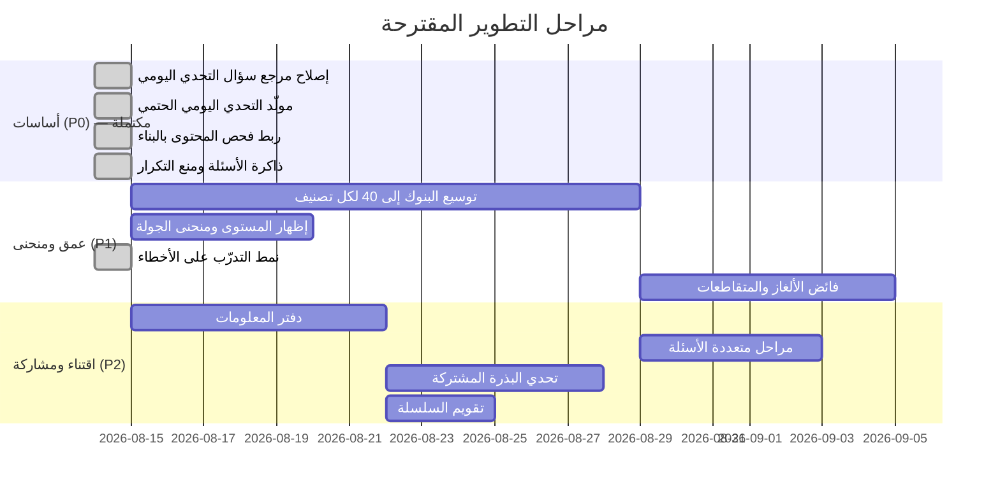

# خطة تطوير «دبارة» — التصميم والمحتوى والميزات

> وُضعت هذه الخطة بعد مراجعة كاملة لبنوك الأسئلة وقراءة مسارات اللعب في
> الشيفرة. كل بند فيها مبني على شاهد من الملفات، لا على تخمين؛ والشاهد مذكور
> مع كل بند حتى يمكن مراجعته أو نقضه. البنود المنجزة موسومة، وما تبقى منها
> مذكور صراحةً تحت كل بند.

---

## 0. نقطة البداية

> هذا الجدول **لقطة يوم كُتبت الخطة (14 أغسطس 2026)**، تُركت كما هي ليبقى
> مقياس ما تحرّك. الأرقام الجارية في
> [roadmap.md](./roadmap.md#أرقام-المحتوى-الحالية)، ويعطيها `npm run questions:check`
> في كل تشغيل.

| المحتوى | يوم كُتبت الخطة | اليوم |
| --- | --- | --- |
| اختيار من متعدد | 356 | **393** في 9 تصنيفات |
| صح/خطأ (سباق السرعة) | 50 | 50 (25/25 متوازنة) |
| ترتيب حروف | 17 (= عدد المراحل، بلا فائض) | **52** — سنة كاملة |
| كلمات متقاطعة | 18 (كانت 3) | **52** — سنة كاملة |
| أسئلة موثّقة بمصدر | 0 | **167**، ولا صعب ولا خبير بلا مصدر |
| تحديات يومية | مولَّدة من التاريخ | مولَّدة، وأقصر فاصل تكرار 364 يوماً |
| مدن ومراحل | 26 مدينة / 95 مرحلة | كما هي، ولكل مدينة 3–4 أسئلة خاصة بها |

**ما أُنجز حتى الآن:** تصحيح أخطاء واقعية، وإزالة بديل ملتبس، وإعادة معايرة
الصعوبة على كل البنك، وتوزيع موقع الإجابة (**56/56/54/53** بعد أن كان 50% منها
في الموضع الثاني)، وفحص محتوى آلي مربوط بالبناء، وصفحة مراجعة تفاعلية، ومولّد
للتحدي اليومي، وذاكرة أسئلة تمنع التكرار وتفتح نمط التدرّب على الأخطاء.

---

## 1. المبادئ الحاكمة للخطة

مأخوذة من [PRODUCT.md](./PRODUCT.md)، وكل بند أدناه يُقاس عليها:

1. **الدقة هي المنتج.** ما لا يمكن توثيقه يُحذف أو يُعاد صوغه، ولا يُخمَّن.
2. **مجاني وغير محجوب.** لا شيء خلف دفع أو حساب أو اتصال.
3. **لا تُعرض بيانات مُختلقة كأنها حقيقية.**
4. **يعمل دون إنترنت على أي هاتف.**
5. **محلي اليوم، جاهز للخادم غداً** — أي حالة جديدة تُخزَّن بشكل يقبل المزامنة لاحقاً.
6. **قرار الجمهور الأساسي ما زال مفتوحاً**، فلا تُبنى آلية تفترض سياقاً
   لا يملكه إلا فئة واحدة (فصل دراسي، لاعب ثانٍ حاضر، إلمام مسبق باللهجة).

---

## 2. المسار الأول: المحتوى

### م-1 — عمق البنك لا يكفي نمط اللعب الحالي ⬤ أولوية عالية

**الشاهد:** جولة اللعب السريع تسحب 5 أسئلة من تصنيف واحد، وأصغر التصنيفات كانت:
أدب 16، ثقافة عامة 16، إسلامية 16، علوم 18، رياضة 20 — أي أن جولتين أو ثلاثاً
تستهلكان التصنيف كله.

**خُفّف أثره بـ ز-1** (الجولة صارت تُقدّم غير المرئي، فلا يتكرر سؤال قبل استنفاد
التصنيف)، لكن **الحاجة إلى العمق قائمة**: تصنيف من 21 سؤالاً يعطي أربع جولات
متمايزة فقط، ثم يبدأ التكرار حتماً.

**المقترح:** لا يقل أي تصنيف عن **40 سؤالاً** (المجموع ≈ 360). الترتيب حسب
الحاجة: أدب ← ثقافة عامة ← إسلامية ← علوم ← رياضة ← لهجات ← مطبخ.

**دفعة أولى مُنجزة (+24 سؤالاً):** أدب 16←23، ثقافة عامة 16←22، إسلامية 16←21،
علوم 18←22، جغرافيا 32←34. المجموع 195←219.

**عن مصدر هذه الدفعة:** اقتُرحت صفحة حلول لعبة «وصلة» مصدراً. الحقائق العامة
نفسها ليست ملكاً لأحد، فأُخذت منها المعلومات المتحقَّقة وأُعيدت صياغتها أسئلةَ
اختيار من متعدد بصوت البنك مع بدائل معقولة من نفس المجال (المصدر قائمة إجابات
للعبة كلمات، لا أسئلة اختيار). و**أُسقط ما لم يُوثَّق**: «أول من شيدوا القلاع
= الحبش»، و«الفأر يصبر على العطش أكثر من الجمل»، و«الليلة الثلاثون = دلماء».
وأُعيدت صياغة «الوحيد الذي ورد اسمه في القرآن» لأنها خاطئة كما وردت — أسماء
كثيرة وردت في القرآن — والصيغة الدقيقة: زيد بن حارثة هو **الصحابي** الوحيد
المذكور باسمه صريحاً.

**المعيار:** ألا يقل حجم البنك عن **ثمانية أضعاف** طول الجولة (اليوم الفحص
يشترط ضعفين فقط — عتبة متساهلة تُرفع مع نمو البنك).

### م-2 — التحدي اليومي ليس يومياً ✅ **أُنجز**

**الشاهد:** [dailyPuzzles.ts](src/data/puzzles/dailyPuzzles.ts) يحوي ثلاثة
تحديات بتواريخ ثابتة (13–15 أغسطس 2026). بعدها يسقط الاختيار على
`dailyChallenges[dateHash % 3]` — فيدور اللاعب على ثلاثة تحديات إلى الأبد،
وعناوينها مكتوبة ليوم بعينه («تحدي اليوم: لؤلؤة الصحراء»).

**عيب كامن كان في نفس المسار:** تحدي النوع `trivia` كان يبحث عن سؤاله في بنك
اللهجات وحده، فأي تحدٍ يشير إلى سؤال من بنك آخر يسقط صامتاً على
`dialectQuestions[0]` — وهو ما كان سيقع فوراً مع المولّد الجديد.

**ما نُفّذ:** صار [dailyPuzzles.ts](src/data/puzzles/dailyPuzzles.ts) مولّداً
حتمياً بدل مصفوفة مجدولة يدوياً — `getDailyChallenge(dateKey)` دالة نقية بلا
حالة مخزّنة، فنفس التاريخ يعطي نفس التحدي على كل جهاز وبعد أي إعادة تثبيت.

- **نمط أسبوعي** (4 معلومة / 2 سرعة / 1 حروف) بدل اختيار عشوائي، فلا يتكرر
  النمط نفسه أكثر من يومين متتاليين.
- **لا تكرار قبل استنفاد المجموعة**: كل نوع يمشي في مجموعته بخطوة أولية
  بالنسبة لحجمها، فيزور كل عنصر مرة واحدة قبل أن يعود لأيه. المُقاس فعلياً على
  800 يوم: أول تكرار سؤال بعد **341 يوماً** (بعد استعمال البنك كله)، وأول
  تكرار لغز بعد **119 يوماً** (بعد الـ17 كلها). سباق السرعة لا يتكرر حرفياً
  لأنه يسحب 10 عبارات من 50 وقت اللعب.
- **العناوين مشتقة من المحتوى** (تصنيف السؤال، نوع اللغز) بدل نص مكتوب ليوم بعينه.
- **العيب الكامن أُصلح**: أُنشئ فهرس مشترك [data/questions/index.ts](src/data/questions/index.ts)
  وصار حل مرجع السؤال يمر عليه لا على بنك اللهجات وحده. تحقُّق في المتصفح: أسئلة
  من `history` و`literature` و`dialects` تُحلّ صحيحة، وكانت الثلاثة قبله تُخدَّم
  بـ `dialectQuestions[0]`. واستُعمل الفهرس نفسه في `App.tsx` بدل خريطة مكررة.
- **الفحص الآلي يغطيه الآن**: `questions:check` يولّد 400 يوم ويتحقق من كل مرجع،
  ومن نوافذ عدم التكرار، ومن ألا يتكرر نمط أكثر من يومين.

**تحديث:** صارت المتقاطعة نمطاً رابعاً في التحدي اليومي بعد توسيع الشبكات إلى
ثماني عشرة في **م-3**. النمط الأسبوعي الآن: 3 معلومة / 2 سرعة / 1 حروف / 1 متقاطعة.

### م-3 — لا فائض في الألغاز ✅ **أُنجز** (2026-08-15)

**الشاهد:** 17 لغز حروف مقابل 17 مرحلة حروف، و3 متقاطعات مقابل 3 مراحل.
أي لغز يُستهلك في الخريطة هو نفسه الذي يظهر في التحدي اليومي.

**ما نُفّذ — المتقاطعات من 3 إلى 18:** سبع شبكات ليبية (البحر والمرافئ، شحات
والجبل الأخضر، فزان وقوافل الصحراء، النخيل والواحات، حرف وصناعات، طبرق ودروب
الشرق، لغة وأدب وكرم)، وثماني شبكات معرفة عامة (`cross_gen_01..08`). وصارت
**المتقاطعة نمطاً في التحدي اليومي** بعد أن كانت الشاشة تدعم ثلاثة أنماط فقط —
وهذا ما جعل الشبكات الجديدة قابلة للوصول أصلاً، إذ لا تشير إليها أي مرحلة على
الخريطة.

**عن مصادر المحتوى:** طُرح أخذ الأسئلة من دليل حلول لعبة «وصلة» المنشور على
الإنترنت. لم يُؤخذ منه شيء: ذلك محتوى ألغاز لعبة أخرى بعينها، ونقل مجموعته
إلى «دبارة» مسألة ملكية لا مجرد نقل معلومات عامة؛ كما أن [PRODUCT.md](./PRODUCT.md)
يضع اللعبة على أنها ليبية الهوية لا مسابقة عربية عامة بقشرة ليبية. الشبكات
العامة الثماني مكتوبة من الصفر، وفكرتها البنيوية — «كل مجموعة كلمات تصير شبكة» —
هي ما أُخذ من الاقتراح.

قيدان اكتُشفا أثناء البناء وصارا مفروضين آلياً في `questions:check`:

1. **كل خانة ممتلئة يجب أن يغطيها دليل.** خانة لا يصلها أي دليل تجعل الشبكة
   غير قابلة للحل أصلاً.
2. **حروف لوحة المفاتيح فقط.** لوحة اللعبة فيها ا و ى و ة و ء و ئ و ؤ، وليس
   فيها أ ولا إ ولا آ — فشبكة تحتاج أحدها لا يمكن إكمالها. ولهذا تُكتب الكلمات
   التراثية بألف مجردة (اويا، ادب، ابر) كما بدأت الشبكات الأولى.

وأُصلح دليلان قديمان كانا يذكران إجابتيهما (`cross_trp_01` و`cross_ghad_01`).

**الإغلاق (2026-08-15):** الألغاز صارت **52** والمتقاطعات **52** — واحد لكل
أسبوع من السنة. والمقياس ليس عدد العناصر بل ما يراه اللاعب: بمشي مولّد التحدي
اليومي 900 يوم، أقصر فاصل قبل تكرار أي لغز أو شبكة صار **364 يوماً** بعد أن كان
126. وعتبة الفحص رُفعت من 60 يوماً إلى 300 حتى لا تتآكل السنة بصمت إن حُذف لغز.

هندسة الشبكات الجديدة **تُحلّ بالبحث** في
[crossword-build.mjs](scripts/crossword-build.mjs) لا باليد: تشبيك أربع كلمات في
4×4 هو بالضبط الموضع الذي ينزلق فيه حرف واحد فتقول الشبكة شيئاً ويقول الدليل
غيره. والاختيار البشري يبقى حيث ينفع — على الكلمات والأدلة.

**وثلاثة عشر لغزاً مسوّداً أُسقطت لا أُعيدت صياغتها.** الفحص أبلغ عنها تسريباً،
لكن قراءتها تقول إنها تكرار: البنك يسأل أصلاً عن واحات الجفرة، وعن القديد، وعن
معنى الزنقة، وعن زاوية الجغبوب. لا تصلح إعادة صياغة سؤالاً قائماً بالفعل، فصارت
موضوعات جديدة بدلها.

**ما بقي خياراً مفتوحاً:** **إضافة مراحل متقاطعة لمدن أخرى على الخريطة**. لم
يُنفَّذ لأنه يزيد مجموع النجوم (231 اليوم)، وعتبات الرتب في
[ranks.ts](src/data/ranks.ts) معايرة على هذا الرقم بالذات، فتغييره قرار منتج
لا تنظيف بيانات.

### م-4 — اتساع الموضوعات ⬤ أولوية متوسطة

البنك اليوم قوي في: الآثار الرومانية والإغريقية، الجهاد والاستقلال، المطبخ،
الكرة. وضعيف أو غائب في:

- التراث الأمازيغي والتباوي والطوارقي بوصفه موضوعاً قائماً لا إشارة عابرة.
- الحرف التقليدية (النحاس، الفضة، السعف، النسيج).
- البحر والصيد وموانئ الساحل ومهنه.
- الموسيقى والفنون الشعبية (المألوف، الزكرة، المريسكاوي).
- أعلام ليبيا في العلم والأدب والتعليم، ونساء في التاريخ الليبي.

**الشرط:** كل إضافة تخضع لقاعدة الدقة — ما لا يوثَّق لا يدخل.

### م-5 — لا مرجع لأي معلومة ✅ **أُنجز شطره الآلي** (2026-08-15)

**الشاهد:** [PRODUCT.md](./PRODUCT.md) يسجّل صراحة أن **لا جهة تتحقق من المحتوى
الليبي**، و[roadmap.md](./roadmap.md) يحيل بنوداً بعينها إلى «مراجعة محلية».

**ما نُفّذ:** حقل `source` في `TriviaQuestion`، و`questions:check` يُفشل البناء
على أي سؤال صعب أو خبير بلا مصدر. **167 سؤالاً موثّقاً، ولم يبق صعب ولا خبير بلا
مصدر.** المصدر عمل أو مؤسسة مسمّاة، لا رابط — الرابط يموت والاسم يبقى قابلاً
للتتبع.

**درسان من التوثيق نفسه، يستحقان البقاء:**

- **المصادر المفوَّضة تُختلق.** ثبت اختلاق مصدر كامل لمثل شعبي، نُسب إلى مدونة
  تراث وهو في الحقيقة أسبوعية أخبار لا تحوي المثل ولا النص المقتبس. ولهذا صار
  عقد الأدلة يشترط اقتباساً حرفياً من صفحة تُفتح فعلاً، ويُراجَع بالفتح.
- **التوثيق يكشف دعاوى لا مصادر فقط.** آخر سؤال بلا مصدر (`dia_11`) تبيّن أنه
  يحمل دعوى لا يسندها شيء: المثل موصوف بأنه **ليبي**، والمجموعة الوحيدة التي
  تحمله حرفياً مجموعة عربية عامة (الأمثال العامية لأحمد تيمور، مثل 2817). فحُذف
  الوصف بدل أن يُلتف حوله بمصدر لا يقوله.

**ما بقي:** تمريرة مراجعة من مطّلع ليبي على الأمثال والألقاب المحلية تحديداً.
هذه لا يغني عنها توثيق، وهي المقصودة بزر التبليغ داخل اللعبة.

**بنود موقوفة على تلك المراجعة (لم أستطع توثيقها بثقة كافية):**

| المعرّف | موضع الشك |
| --- | --- |
| `hist_mis_01` | «رأس الرمل» بوصفه اللسان الرملي ومنارة مصراتة |
| `spo_07` / `sb_22` | لقب «الفحامة» لنادي النصر بنغازي |
| `gen_39` | «الشرارة» بوصفه الحقل الأكثر إنتاجاً (رقم متغيّر بطبيعته) |
| `lit_13` | لقب «شاعر الوطن» لأحمد رفيق المهدوي |
| أمثال `dia_*` | صياغات الأمثال ورواياتها تختلف بين المناطق |

---

## 3. المسار الثاني: التصميم واللعب

### ت-1 — الصعوبة موجودة في البيانات وغائبة عن اللعب ⬤ أولوية عالية

**الشاهد:** بحث في كل الشيفرة خارج `src/data` و`src/types` لا يعطي أي استعمال
لحقل `difficulty`. اللاعب لا يراه، والجولة لا ترتّب عليه.

**المقترح** (صار ممكناً الآن بعد أن صارت التصنيفات صادقة):

1. **مؤشر مستوى** على بطاقة السؤال (نقاط/شارة صغيرة) — يجعل المكافأة مفهومة.
2. **منحنى داخل الجولة**: سهل ← متوسط ← صعب بدل خمسة أسئلة عشوائية مسطحة،
   وسؤال ختامي أعلى مستوى ومكافأة.
3. **الوقت يتبع المستوى** بدل مؤقت واحد للجميع.

### ت-2 — المرحلة = سؤال واحد ⬤ أولوية متوسطة

**الشاهد:** كل مرحلة `multiple_choice` في [cities.ts](src/data/cities.ts) تحمل
`questionId` واحداً. فـ 77 مرحلة هي في جوهرها 77 سؤالاً منفرداً.

**المقترح:** مراحل المدن الكبرى تصير 3 أسئلة بنجوم على الأداء (كما في اللعب
السريع)، مع إبقاء المدن الأولى بسؤال واحد حفاظاً على الإيقاع في البداية.
يستهلك هذا محتوى أكثر، فهو تابع لـ **م-1**.

### ت-4 — حزمة المدخل تحمل كل المحتوى ⬤ أولوية منخفضة (تكبر مع البنك)

**الشاهد:** حزمة `index` بعد البناء **212 ك.ب** (56 ك.ب مضغوطة)، وتضم بنوك
الأسئلة والألغاز كاملة، لأن `App.tsx` يحتاج فهرس الأسئلة لحل مراجع مراحل
الخريطة عند الإقلاع. فكل سؤال يُضاف يكبّر أول تحميل — والهدف 360 سؤالاً.

**المقترح:** تأجيل تحميل البنوك بحيث لا يُجلب المحتوى إلا عند فتح مرحلة أو
جولة، مع إبقاء الخريطة (شاشة الهبوط) خفيفة. يحتاج تحويل حل مراجع المراحل إلى
مسار غير متزامن، فهو تغيير معماري صغير لا تنظيف.

### ت-3 — «معلومة ع الماشي» تُقرأ مرة وتضيع ⬤ أولوية متوسطة

**الشاهد:** الـ `funFact` هو الحمولة التعليمية الحقيقية في اللعبة، ويظهر بعد
الإجابة ثم لا يعود.

**المقترح:** «دفتر المعلومات» — كل معلومة يفتحها اللاعب تُحفظ في دفتر قابل
للتصفح والبحث والمشاركة، مصنّف حسب المدينة والتصنيف. يحوّل اللعبة من اختبار
عابر إلى شيء يُقتنى.

---

## 4. المسار الثالث: الميزات

### ز-1 — التدرّب على الأخطاء ✅ **أُنجز**

**الشاهد:** المخزن يسجّل عدّادات فقط (`recordQuestionAnswer(isCorrect)` في
[useGameStore.ts:28](src/store/useGameStore.ts#L28))، ولا يحتفظ بأي سجل لأي
سؤال أُخطئ فيه. فلا يمكن اليوم بناء أي مراجعة.

**ما نُفّذ:** أُضيف `seenQuestionIds` و`missedQuestionIds` إلى المخزن، وصار
`recordQuestionAnswer` يستقبل معرّف السؤال — اختيارياً، لأن سباق السرعة لا سؤال
مفرد له. والحقلان ضمن `partialize` ليُزامنا مع الخادم لاحقاً دون إعادة بناء.

- **منع التكرار**: جولة اللعب السريع صارت تُقدّم غير المرئي أولاً ولا تعود إلى
  سؤال قبل استنفاد التصنيف. مقاس فعلياً على بنك الإسلاميات (21 سؤالاً):
  **21 سؤالاً متمايزاً قبل أي تكرار**، بدل تكرار محسوس في الجولة الثانية.
- **نمط «تدرّب على أخطائك»**: جولة من الأسئلة المُخطأ فيها عبر كل التصنيفات،
  ولا يخرج السؤال من القائمة إلا بإجابة صحيحة — فالقائمة تنكمش بالتعلّم لا
  بمجرد إعادة العرض. واللافتة لا تظهر إلا حين يكون فيها شيء فعلاً.

**ما تبقى:** التباعد الزمني (spaced repetition) لم يُنفَّذ؛ الترتيب داخل قائمة
الأخطاء عشوائي، لا مجدول بفواصل متزايدة.

### ز-2 — تحدٍ بين صديقين بلا خادم ⬤ قيمة عالية للجمهور المغترب

**المقترح:** ترميز «بذرة الجولة» (نفس الأسئلة بنفس الترتيب) في رابط أو داخل
بطاقة المشاركة القائمة على Canvas. يفتحه الصديق فيلعب **نفس الجولة** ويقارن
نتيجته. لا حساب، لا خادم، ويعمل مع البنية الحالية.

### ز-3 — تقويم السلسلة ⬤ أولوية منخفضة

السلسلة اليومية موجودة ومحفوظة، لكن لا يراها اللاعب إلا كرقم. شبكة شهرية
بسيطة تُظهر أيام الحضور تجعل الاستمرار مرئياً.

### ز-4 — موقوف على قرار الجمهور

**«وضع العائلة/المعلّم»** (جولة موجّهة، أسئلة حسب العمر، تقرير للمعلم) ميزة
قوية لكنها تفترض سياقاً لا يملكه إلا جمهور واحد من الثلاثة، وهذا يخالف الشرط
المسجّل في PRODUCT.md. **لا تُبنى قبل حسم الجمهور الأساسي.**

---

## 5. المسار الرابع: بنية المحتوى (أُنجز جزؤه الأول)

- [x] `npm run questions:export` — تجميع كل البنوك في JSON وصفحة مراجعة تفاعلية.
- [x] `npm run questions:check` — فحص آلي: تفرد المعرفات، أربعة خيارات متمايزة،
      ألا يحوي السؤال إجابته، مطابقة المكافأة للصعوبة، توزّع موقع الإجابة،
      توازن سباق السرعة، مطابقة حروف الألغاز لإجاباتها، مطابقة أدلة المتقاطعة
      لشبكتها، وسلامة كل مرجع في الخريطة والتحدي اليومي.
- [x] **ربط الفحص بالبناء**: `build` صار `questions:check && tsc -b && vite build`،
      وجُرّب بإفساد مكافأة سؤال عمداً فأوقف البناء قبل `tsc`.
- [ ] رفع عتبة حجم التصنيف في الفحص كلما نما البنك.

> ملاحظة تصحيحية: كان [roadmap.md](./roadmap.md) يذكر «فحصاً آلياً للمحتوى»
> ضمن المنجز، ولم يكن له وجود في المستودع. صار موجوداً الآن فعلاً.

---

## 6. الترتيب الزمني المقترح

**لماذا هذا الترتيب:** منع التكرار (ز-1) يشتري تحسّناً محسوساً فوراً بتكلفة
أقل بكثير من كتابة 165 سؤالاً، فيسبقه. وتوسيع البنك يسبق المراحل متعددة
الأسئلة لأنها تستهلك محتوى. وربط الفحص بالبناء أولاً لأنه يحمي كل ما بعده.

---

## 7. قرارات مطلوبة منك

| القرار | لماذا هو حاجز |
| --- | --- |
| **الجمهور الأساسي** من الثلاثة | يحسم ز-4، ويحدد نبرة الأسئلة الجديدة ومستواها |
| **من يراجع المحتوى الليبي** | يحسم م-5 وقائمة البنود الموقوفة أعلاه |
| هل نضيف حقل `source` للأسئلة | يغيّر شكل البيانات، فيُحسم قبل كتابة 165 سؤالاً جديداً |
| هل تُكتب الأسئلة الجديدة دفعة واحدة أم على دفعات لكل تصنيف | يغيّر ترتيب P1 |

---

## 8. ما لا تتضمنه هذه الخطة عمداً

- **أي شيء يحتاج خادماً** — المقارنة بين اللاعبين والحسابات والمزامنة تنتظر
  قرار الخادم المسجّل في PRODUCT.md. كل ما أعلاه يعمل محلياً ودون إنترنت.
- **الشراء داخل التطبيق أو الإعلانات** — يخالف مبدأ «مجاني وغير محجوب».
- **إعادة تصميم بصري** — نظام Neo-Heritage في [design.md](./design.md) ملزم
  وقائم، ولا حاجة لمسّه لتنفيذ أي بند هنا.
- **لغة ثانية** — العربية RTL هي المنتج لا ترجمة له.
