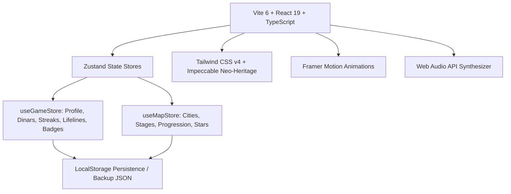

# الخطة المعمارية والتقنية - لعبة «دبارة» (Architecture & Technical Plan)

---

## 1. الهيكل التقني المعتمد (Technology Stack)



- **Frontend Core**: React 19 + TypeScript + Vite 6
- **Styling**: Tailwind CSS v4 + Vanilla CSS Design Tokens (Neo-Heritage Palette)
- **Animation & FX**: Framer Motion + Canvas Confetti
- **State Management**: Zustand (مع وسيط الـ `persist` و `LocalStorage`)
- **Audio Engine**: Web Audio API Sound Synthesizer (توليد نغمات ونبضات صوتية فورية خفيفة بدون ملفات صوتية ثقيلة)
- **Icons**: Lucide React + أيقونات متجهة (SVG Vector Beacons)

---

## 2. بنية المجلدات والمكونات (Directory Structure)

```
c:/Users/masal/Documents/opencode/trivia-game/
├── public/
│   ├── assets/
│   │   └── libya-map.png              # خريطة تضاريس ليبيا الجغرافية
├── src/
│   ├── audio/
│   │   └── soundEffects.ts            # محرك توليد المؤثرات الصوتية (Web Audio API)
│   ├── components/
│   │   ├── HeaderHUD.tsx              # الشريط العلوي (الدنانير، النجوم، الملف، الصوت)
│   │   ├── BottomNav.tsx              # شريط التنقل السفلي للهاتف
│   │   └── SettingsModal.tsx          # نافذة الإعدادات والنسخ الاحتياطي
│   ├── data/
│   │   ├── cities.ts                  # بيانات مدن ومراحل وإحداثيات خريطة ليبيا
│   │   ├── badges.ts                  # بيانات الأوسمة الثقافية والتراثية
│   │   ├── questions/                 # بنوك أسئلة الاختيار من متعدد
│   │   │   ├── history.ts             # تاريخ وآثار ليبيا
│   │   │   ├── dialects.ts            # اللهجات والأمثال الشعبية
│   │   │   ├── sports.ts              # الرياضة والكرة الليبية
│   │   │   ├── foodTraditions.ts      # المطبخ والتقاليد والعادات
│   │   │   └── generalArab.ts         # الثقافة والمعارف العربية
│   │   └── puzzles/                   # بنوك الألغاز
│   │       ├── wordScramble.ts        # ترتيب الحروف والأمثال
│   │       ├── crosswords.ts          # الكلمات المتقاطعة المصغرة
│   │       └── dailyPuzzles.ts        # الألغاز والتحديات اليومية
│   ├── features/
│   │   ├── map/                       # شاشات ومكونات خريطة ليبيا
│   │   │   ├── LibyaVectorMap.tsx     # خريطة ليبيا الجغرافية والنقاط التفاعلية
│   │   │   ├── CityDetailModal.tsx    # نافذة تفاصيل مراحل المدينة والنبذة
│   │   │   └── MapScreen.tsx          # الشاشة الرئيسية للرحلة الاستكشافية
│   │   ├── quiz/                      # محركات المسابقات
│   │   │   ├── QuizScreen.tsx         # واجهة أسئلة الاختيار مع وسائل المساعدة
│   │   │   └── SpeedBlitz.tsx         # وضع سباق السرعة (60 ثانية)
│   │   ├── puzzles/                   # محركات الألغاز
│   │   │   ├── LetterScramble.tsx     # محرك ترتيب الحروف
│   │   │   └── MiniCrossword.tsx      # محرك الكلمات المتقاطعة 4×4 مع لوحة المفاتيح
│   │   ├── quickplay/
│   │   │   └── CategoryHub.tsx        # صالة الجولات السريعة حسب الموضوع
│   │   ├── daily/
│   │   │   └── DailyChallengeScreen.tsx # شاشة اللغز اليومي ومضاعف الأيام
│   │   └── badges/
│   │       └── BadgesScreen.tsx       # مجلس الأوسمة ومتجر المساعدات
│   ├── store/
│   │   ├── useGameStore.ts            # مخزن الحالة الاقتصادية والمستخدم
│   │   └── useMapStore.ts             # مخزن تقدم الخريطة وفتح المراحل
│   ├── types/
│   │   ├── game.ts                    # أنواع الملف والمساعدات والأوسمة
│   │   ├── map.ts                     # أنواع المدن والأقاليم والمراحل
│   │   ├── quiz.ts                    # أنواع الأسئلة والاختيارات
│   │   └── puzzle.ts                  # أنواع ألغاز الحروف والكلمات المتقاطعة
│   ├── App.tsx                        # المكون الرئيسي وموزع الشاشات
│   ├── index.css                      # نظام الرموز اللونية والفئات الزجاجية
│   └── main.tsx                       # مدخل التطبيق
├── design.md                          # وثيقة نظام التصميم (Impeccable System)
├── plan.md                            # الخطة التقنية والمعمارية
├── prd.md                             # وثيقة متطلبات المنتج
└── roadmap.md                         # خارطة طريق التسليم
```

---

## 3. آليات حفظ الحالة وإدارة التقدم (State & Progression Logic)

### أ. فتح المراحل والمدن (Unlocking Engine)
1. في كل مدينة، تكون المرحلة الأولى مفتوحة افتراضياً إذا كانت المدينة مفتوحة.
2. عند إحراز نجمة واحدة على الأقل في مرحلة ما، تُفتح المرحلة التالية مباشرة في نفس المدينة.
3. فتح المدن الجديدة يعتمد على إجمالي عدد النجوم المكتسبة (`requiredStarsToUnlock`).

### ب. نظام المساعدات والدنانير (Economy Engine)
- مكافآت الدنانير الليبية تُمنح عند إنهاء كل مرحلة وعند تحقيق التحدي اليومي.
- يمكن صرف الدنانير في متجر المساعدات لشراء:
  - ✂️ حذف خيارين (50:50)
  - 💡 كشف حرف
  - ⏭️ تخطي السؤال
  - ⏳ إضافة 15 ثانية

---

## 4. خطة التحسين المستمر لخريطة ليبيا (Continuous Map Polish)
1. **الطبقة الجغرافية**: الحفاظ على التضاريس والخط الساحلي الواقعي لخليج سرت وشبه جزيرة برقة وصحراء فزان.
2. **الإحداثيات الحقيقية**: ضبط إحداثيات المدن بدقة متناهية على اليابسة لمنع خروج النقاط إلى البحر أو تداخل التسميات.
3. **توسيع نقاط المدن**: إضافة مدن ومناطق إضافية في التحديثات القادمة (مصراتة، زوارة، درنة، طبرق، نالوت، جالو وأوجلة).
