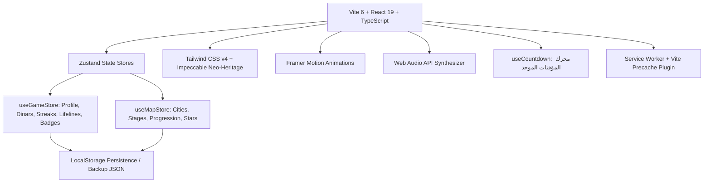
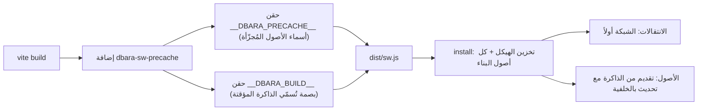

# الخطة المعمارية والتقنية - لعبة «دبارة» (Architecture & Technical Plan)

---

## 1. الهيكل التقني المعتمد (Technology Stack)



- **Frontend Core**: React 19 + TypeScript + Vite 6
- **Styling**: Tailwind CSS v4 + Vanilla CSS Design Tokens (Neo-Heritage Palette)
- **Animation & FX**: Framer Motion + Canvas Confetti
- **State Management**: Zustand (مع وسيط الـ `persist` و `LocalStorage`)
- **Audio Engine**: Web Audio API Sound Synthesizer (توليد نغمات ونبضات صوتية فورية خفيفة بدون ملفات صوتية ثقيلة)
- **Icons**: Lucide React + أيقونات متجهة (SVG Vector Beacons)
- **Offline**: Service Worker مكتوب يدوياً + إضافة Vite تحقن قائمة أصول البناء المُجزّأة

---

## 2. بنية المجلدات والمكونات (Directory Structure)

```
c:/Users/masal/Documents/opencode/trivia-game/
├── public/
│   ├── assets/
│   │   └── libya-map.png              # خريطة تضاريس ليبيا الجغرافية
│   ├── manifest.webmanifest           # بيان التطبيق التقدمي والاختصارات
│   └── sw.js                          # عامل الخدمة (تخزين مؤقت وتشغيل دون إنترنت)
├── scripts/
│   └── setup-playwright-driver.js     # تهيئة مشغل Playwright للاختبار في المتصفح
├── src/
│   ├── audio/
│   │   └── soundEffects.ts            # محرك توليد المؤثرات الصوتية والاهتزاز (Web Audio API)
│   ├── hooks/
│   │   └── useCountdown.ts            # محرك المؤقتات الموحد (مبني على وقت نهاية مطلق)
│   ├── components/
│   │   ├── HeaderHUD.tsx              # الشريط العلوي (الدنانير، النجوم، الملف، الصوت)
│   │   ├── BottomNav.tsx              # شريط التنقل السفلي للهاتف
│   │   ├── ShareResultModal.tsx       # توليد بطاقة الإنجاز على Canvas ومشاركتها
│   │   └── SettingsModal.tsx          # نافذة الإعدادات والنسخ الاحتياطي
│   ├── data/
│   │   ├── cities.ts                  # بيانات مدن ومراحل وإحداثيات خريطة ليبيا
│   │   ├── badges.ts                  # بيانات الأوسمة الثقافية والتراثية
│   │   ├── questions/                 # بنوك الأسئلة (9 تصنيفات، 182 سؤالاً)
│   │   │   ├── history.ts             # تاريخ وآثار ليبيا
│   │   │   ├── dialects.ts            # اللهجات والأمثال الشعبية
│   │   │   ├── sports.ts              # الرياضة والكرة الليبية
│   │   │   ├── foodTraditions.ts      # المطبخ والتقاليد والعادات
│   │   │   ├── geography.ts           # جغرافيا ليبيا والعالم
│   │   │   ├── islamic.ts             # الدين والحضارة الإسلامية
│   │   │   ├── literature.ts          # اللغة العربية وأدبها
│   │   │   ├── science.ts             # العلوم والطبيعة
│   │   │   ├── generalArab.ts         # ثقافة عامة ومنوعات (وفيها قواعد الكتابة)
│   │   │   └── speedBlitz.ts          # 50 عبارة صح/خطأ لسباق السرعة
│   │   └── puzzles/                   # بنوك الألغاز
│   │       ├── wordScramble.ts        # ترتيب الحروف والأمثال
│   │       ├── crosswords.ts          # الكلمات المتقاطعة المصغرة
│   │       └── dailyPuzzles.ts        # الألغاز والتحديات اليومية
│   ├── features/
│   │   ├── map/                       # شاشات ومكونات خريطة ليبيا
│   │   │   ├── projection.ts          # إسقاط Mercator المعاير: إحداثيات حقيقية ← بكسل الصورة
│   │   │   ├── pinLayout.ts           # فضّ ازدحام الدبابيس مع خطوط دالة على الموضع الحقيقي
│   │   │   ├── stageLayout.ts         # توزيع عقد المراحل حول دبوس المدينة بلا تصادم
│   │   │   ├── LibyaVectorMap.tsx     # خريطة ليبيا الجغرافية والنقاط التفاعلية
│   │   │   ├── CityDetailModal.tsx    # نافذة تفاصيل مراحل المدينة والنبذة
│   │   │   └── MapScreen.tsx          # الشاشة الرئيسية للرحلة الاستكشافية
│   │   ├── quiz/                      # محركات المسابقات
│   │   │   ├── QuizScreen.tsx         # واجهة أسئلة الاختيار مع وسائل المساعدة
│   │   │   └── SpeedBlitz.tsx         # وضع سباق السرعة (45 ثانية + وقت إضافي)
│   │   ├── multiplayer/
│   │   │   └── PassAndPlayScreen.tsx  # التحدي الثنائي على نفس الجهاز بالتناوب
│   │   ├── puzzles/                   # محركات الألغاز
│   │   │   ├── LetterScramble.tsx     # محرك ترتيب الحروف
│   │   │   └── MiniCrossword.tsx      # محرك الكلمات المتقاطعة 4×4 مع لوحة المفاتيح
│   │   ├── quickplay/
│   │   │   └── CategoryHub.tsx        # صالة الجولات السريعة حسب الموضوع
│   │   ├── daily/
│   │   │   └── DailyChallengeScreen.tsx # شاشة اللغز اليومي ومضاعف الأيام
│   │   └── badges/
│   │       ├── BadgesScreen.tsx       # مجلس الأوسمة ومتجر المساعدات
│   │       └── LeaderboardTab.tsx     # لوحة الشرف الأسبوعية والموسم التنافسي
│   ├── store/
│   │   ├── useGameStore.ts            # مخزن الحالة الاقتصادية والمستخدم
│   │   └── useMapStore.ts             # مخزن تقدم الخريطة وفتح المراحل
│   ├── types/
│   │   ├── game.ts                    # أنواع الملف والمساعدات والأوسمة
│   │   ├── map.ts                     # أنواع المدن والأقاليم والمراحل
│   │   ├── quiz.ts                    # أنواع الأسئلة والاختيارات
│   │   └── puzzle.ts                  # أنواع ألغاز الحروف والكلمات المتقاطعة
│   ├── App.tsx                        # المكون الرئيسي وموزع الشاشات (تحميل كسول + فهرسة الأسئلة)
│   ├── index.css                      # نظام الرموز اللونية والفئات الزجاجية
│   └── main.tsx                       # مدخل التطبيق
├── design.md                          # وثيقة نظام التصميم (Impeccable System)
├── plan.md                            # الخطة التقنية والمعمارية
├── prd.md                             # وثيقة متطلبات المنتج
└── roadmap.md                         # خارطة طريق التسليم
```

---

## 3. آليات حفظ الحالة وإدارة التقدم (State & Progression Logic)

### أ. فتح المراحل والمدن (Unlocking Engine)
1. في كل مدينة، تكون المرحلة الأولى مفتوحة افتراضياً إذا كانت المدينة مفتوحة.
2. عند إحراز نجمة واحدة على الأقل في مرحلة ما، تُفتح المرحلة التالية مباشرة في نفس المدينة.
3. فتح المدن الجديدة يعتمد على إجمالي عدد النجوم المكتسبة (`requiredStarsToUnlock`).

### ب. نظام المساعدات والدنانير (Economy Engine)
- مكافآت الدنانير الليبية تُمنح عند إنهاء كل مرحلة وعند استلام المكافأة اليومية.
- يمكن صرف الدنانير في متجر المساعدات لشراء:
  - ✂️ حذف خيارين (50:50) — 20 ديناراً
  - 💡 كشف حرف — 15 ديناراً
  - ⏭️ تخطي السؤال — 40 ديناراً
  - ⏳ إضافة 15 ثانية — 25 ديناراً
- **قواعد صارمة تحكم الاقتصاد** (كانت كلها مخترقة قبل مراجعة المرحلة 5):
  - **التخطي يجتاز المرحلة بنجمة واحدة فقط، دون دنانير، ودون احتسابه إجابة صحيحة**. كان سابقاً يمنح 3 نجوم ومكافأة كاملة ويرفع نسبة الدقة مقابل 40 ديناراً.
  - **تسوية المكافأة تحدث مرة واحدة لكل جولة** بقفل (`ref`) لا يعتمد على الحالة، لأن انتهاء الوقت وآخر إجابة قد يتزامنان في سباق السرعة.
  - **المكافأة اليومية تُستلم بضغطة من اللاعب** وتُختم بتاريخ اليوم في `profile.lastLoginDate`، فلا تتكرر بإعادة التحميل.
  - **مكافأة الجولة السريعة تتناسب مع الأداء**: 25 ديناراً + 10 لكل إجابة صحيحة.

### ج. محرك المؤقتات (Countdown Engine)
`useCountdown` هو المصدر الوحيد لكل عدّاد في اللعبة (المسابقة 25 ثانية، سباق السرعة 45 ثانية، المبارزة 20 ثانية).

- يعتمد على **وقت نهاية مطلق** لا على تراكم `prev - 1`، فلا ينحرف العدّاد عند انشغال الخيط الرئيسي.
- كل ردود النداء (`onExpire` / `onTick`) تُستدعى من جسم الـ interval **لا من داخل دالة تحديث الحالة**؛ الاستدعاء من داخل المحدِّث كان يتضاعف تحت `StrictMode`.
- `onExpire` مضمون مرة واحدة لكل تشغيل، و`running=false` يُجمّد الوقت المتبقي ويستأنفه لاحقاً من حيث توقف.
- إضافة الوقت (`addTime`) تُزحزح وقت النهاية بدل إعادة بناء الـ interval.

### د. الحفظ الدائم (Persistence)
- `useGameStore` يحفظ `profile` و`audio` و`stats` و`unlockedBadges` فقط؛ أما `currentMode` و`activeCategory` فحالة عرض لا تُحفظ.
- `useMapStore` يحفظ `cities` و`selectedCityId` فقط؛ `activeStage` عابرة، وحفظها كان يُعيد اللاعب إلى مرحلة نصف ملعوبة بمؤقت جديد.
- عند استرجاع الحفظ تُدمج المدن مع `initialCities` عبر `mergeCitiesWithInitial`، فيحتفظ اللاعب بتقدمه وتظهر له المدن والمراحل المضافة في التحديثات. ونفس الدمج يمر به استيراد النسخة الاحتياطية.
- إعدادات الصوت والاهتزاز تُطبَّق على محرك الصوت في `onRehydrateStorage`؛ بدونها كان الكتم يُعرض في الواجهة دون أن يُطبَّق فعلياً بعد إعادة التحميل.

---

## 3.5 معمارية التشغيل دون إنترنت (Offline Architecture)



- **حقن قائمة الأصول وقت البناء ضروري**: عامل الخدمة يُشحن من `public/` فلا يعرف الأسماء المُجزّأة، وملفات JS/CSS تُطلب قبل أن يتولى العامل السيطرة — فلا يخزّنها شيء، وتفشل أول زيارة دون إنترنت رغم «اكتمال» التخزين.
- **`ignoreVary: true` عند المطابقة**: العامل يجلب الأصول بلا ترويسة `Origin`، بينما الصفحة تطلب وحداتها بـ `crossorigin` (أي بترويسة `Origin`). أي خادم يرد بـ `Vary: Origin` — ومنها خادم معاينة Vite نفسه — يجعل كل أصل يفشل في المطابقة.
- **الانتقالات بالشبكة أولاً**: كانت بالذاكرة أولاً، فيتأخر أي تحديث منشور إصداراً كاملاً خلف إعادة تحميل.
- **اسم الذاكرة المؤقتة موسوم ببصمة البناء**، و`activate` يحذف كل ما عداه.
- **لا يُسجَّل العامل على خادم التطوير**، بل يُلغى تسجيل أي عامل قديم؛ تسجيله هناك كان يخزّن وحدات Vite ويجمّد التعديلات.

---

## 4. إسقاط الخريطة وتموضع المدن (Map Projection)

المدن تحمل **إحداثيات جغرافية حقيقية** (`latitude` / `longitude`)، و[projection.ts](file:///c:/Users/masal/Documents/opencode/trivia-game/src/features/map/projection.ts) هو المكان الوحيد الذي يحوّلها إلى مواضع على الصورة. تخزين النسب المئوية للشاشة داخل البيانات — كما كان سابقاً — كان يعني إعادة ضبط كل دبوس يدوياً عند أي تغيير في الصورة أو إطارها، ولا وسيلة للتمييز بين دبوس صحيح وآخر يبدو معقولاً وهو خاطئ.

**كيف عُوير الإسقاط:**
1. قياس حدّ ليبيا الذهبي في ملف الصورة برمجياً: يمتد على `x 26–255` و`y 173–399`.
2. نسبة البكسل لكل درجة عرض إلى الطول ≈ **1.13**، وهي تطابق `sec(φ)` عند خط عرض ليبيا الأوسط (1.12) وتستبعد الإسقاط المستطيل المتساوي (حيث تكون النسبة 1.0) → الصورة بإسقاط **Web Mercator**.
3. معايرة الثوابت بحيث ينطبق الصندوق المحيط على أطراف ليبيا الحقيقية: `9.31°E–25.00°E` و`19.50°N–33.17°N`.
4. التحقق مقابل الخط الساحلي المرسوم عند طرابلس والخمس وسرت والعقيلة وبنغازي ودرنة وطبرق — **كلها ضمن ~1.5 بكسل** من الشاطئ المرسوم.

**هندسة الطبقة التفاعلية:** الصورة `object-cover` داخل حاوية أعرض نسبياً منها، فتُقاس على العرض وتُقتطع رأسياً من المنتصف. طبقة الدبابيس والمسارات تعيد إنتاج ذلك تماماً (عرض كامل + نسبة أبعاد الصورة + توسيط)، فتصبح كل الإحداثيات بداخلها إحداثيات صورة خام وتبقى مطابقة مهما تغيّر حجم الحاوية. تم التحقق عند عروض 360 و430 و500 و768 بكسل: **الخطأ أقل من 0.1 بكسل**.

**المسارات** تُولَّد من أزواج المدن مع معامل انحناء، فتنتهي دائماً عند الدبابيس بدقة؛ كانت سابقاً إحداثيات مكتوبة يدوياً تشير إلى أماكن خاطئة بمجرد تحرّك أي دبوس. مسار خليج سرت ينحني بما يكفي ليتبع الشاطئ بدل قطع المياه المفتوحة.

**التسميات** تُوضع يدوياً عبر `labelOffset` بالبكسل (كما يزيح رسّام الخرائط التسميات المتزاحمة)، وتستخدم اسماً مختصراً `mapLabel` على الدبوس بينما تحمل بطاقة التفاصيل الاسم الكامل — لأن الإحداثيات الحقيقية تجعل مدن الساحل متقاربة جداً.

**فضّ ازدحام الدبابيس** ([pinLayout.ts](file:///c:/Users/masal/Documents/opencode/trivia-game/src/features/map/pinLayout.ts)): طرابلس ومسلاتة ولبدة ومصراتة تقع فعلياً داخل نحو 130 كم، أي أقل من 30 بكسل بمقياس الخريطة — أقرب من عرض دبوس واحد. الحل ليس تحريف الإحداثيات في البيانات (فذلك يُفقد كل الدبابيس قابلية التحقق لإصلاح أربعة منها)، بل تحريك **الرمز المرسوم** فقط:

- الموضع الحقيقي يبقى «مرساة»، وتُرسم عنده نقطة صغيرة يصلها خط رفيع بالدبوس المُزاح، فيظل الموقع الفعلي معلناً.
- استرخاء تكراري بقوتين: **تنافر** يفصل أي دبوسين أقرب من الحد الأدنى، و**تجاذب** يشد كل دبوس نحو موضعه الحقيقي. التجاذب هو ما يحفظ الأمانة: الإزاحة أقل ما يلزم للفصل، لا انتشاراً في الخريطة.
- تصغير حجم الدبوس نفسه يقلل الإزاحة المطلوبة، ولذلك صُغِّر رمز المدينة.

النتيجة المقاسة: **لا تداخل بين أي دبوسين**، بمتوسط إزاحة 3.8 بكسل وأقصاها 11.2 على خريطة عرضها 286 — ومدن الصحراء (غدامس، غات، جالو، الكفرة، نالوت، سبها) لا تتحرك إطلاقاً لأنها غير مزدحمة أصلاً.

---

## 4.2 تموضع المراحل حول المدينة (Stage Constellation)

عند اختيار مدينة مفتوحة، تتفتّح مراحلها كعقد حول دبوسها على الخريطة. لا تُخزَّن مواضع هذه العقد في البيانات: المساحة المتاحة حول أي دبوس تعتمد على جيرانه وعلى حافة الصورة، فجدول إزاحات ثابت كان سيصطدم بلبدة على ساحل طرابلس ويتدلّى خارج الحافة عند درنة. لذلك تُشتق في [stageLayout.ts](file:///c:/Users/masal/Documents/opencode/trivia-game/src/features/map/stageLayout.ts).

**كيف تُختار المواضع:** بحث شامل على ثلاثة أبعاد — الاتجاه (كل 10°)، ونصف القطر، وعرض المروحة — يُقيَّم كل تركيب بدالة عقوبة:

| العقوبة | السبب |
| --- | --- |
| خروج عن المساحة الآمنة | العقدة تُقصّ عند حافة الخريطة |
| اقتراب من دبوس مدينة أخرى (< 30 بكسل) | تداخل بصري مع الجيران |
| اقتراب من تسمية مدينة أخرى (< 22 بكسل) | العقدة تحجب اسم مدينة |
| تقارب العقد فيما بينها (< 25 بكسل) | العقد تتراكب على بعضها |
| انحراف عن نصف القطر/العرض المفضّل | للحفاظ على شكل موحّد حين تسمح المساحة |

يبدأ البحث من الشمال فتتفتّح المدن غير المزدحمة فوق البحر، والنتيجة **حتمية** (ترتيب ثابت للمرشحين، والتعادل يبقي الأول) فتتفتّح المدينة نفسها بالشكل نفسه دائماً. العقوبات الأخيرة أُضيفت بعد أن كشف الاختبار أن البحث كان يقلّص نصف القطر للهروب من جار فيكدّس العقد فوق بعضها.

تم التحقق آلياً من **كل** المدن الاثنتي عشرة: لا خروج عن الحافة، ولا تداخل مع الجيران، ولا تراكب بين العقد. أصعب حالتين: **نالوت** (محصورة بين طرابلس وغدامس والحافة الغربية) و**غدامس** (على الطرف الغربي بخمس مراحل) — وكلتاهما تُحلّان بمروحة أضيق ونصف قطر مختلف.

**التفاعل:** نقر الدبوس يفتح المراحل على الخريطة مباشرة (كان يفتح بطاقة التفاصيل فوراً فلا تظهر المراحل على الخريطة أبداً)، ونقر عقدة مرحلة مفتوحة يبدأها. بطاقة التفاصيل الكاملة (الإضاءة التاريخية والمكافآت وسبب القفل) تبقى على بُعد نقرة عبر زر «استكشف». المدن المقفلة لا تتفتّح — لا شيء قابلاً للعب فيها، وسبب القفل مكانه البطاقة.

---

## 4.1 خطة التحسين المستمر لخريطة ليبيا (Continuous Map Polish)
1. **الطبقة الجغرافية**: الحفاظ على التضاريس والخط الساحلي الواقعي لخليج سرت وشبه جزيرة برقة وصحراء فزان.
2. **الإحداثيات الحقيقية**: ✅ صارت مشتقة من إحداثيات فعلية عبر إسقاط معاير، لا من نسب مضبوطة يدوياً.
3. **توسيع نقاط المدن**: ✅ الوصول إلى 13 محطة (أُضيفت مصراتة، درنة، نالوت وجبل نفوسة، جالو وأوجلة، ثم مسلاتة). مرشحات التحديثات القادمة: زوارة، طبرق، سرت، البيضاء.
4. **هدف اللمس**: اسم المدينة أسفل الدبوس جزء من منطقة النقر (كان `pointer-events-none` فلا يستجيب، ويجبر اللاعب على إصابة الدائرة الصغيرة).

---

## 4.3 بنوك الأسئلة وضمان جودتها (Question Banks & Content QA)

**بنك واحد لكل تصنيف**، وعضوية الملف هي ما يحدد التصنيف فعلياً (حقل `category` توثيقي، ويتحقق فحص آلي من تطابقه مع البنك الذي يسكنه). قواعد كتابة السؤال موثقة في رأس [generalArab.ts](file:///c:/Users/masal/Documents/opencode/trivia-game/src/data/questions/generalArab.ts) وملخصة في [prd.md](file:///c:/Users/masal/Documents/opencode/trivia-game/prd.md).

**الفحص الآلي للمحتوى** يشمل: تفرد المعرفات، أربعة خيارات متمايزة لكل سؤال، `correctIndex` داخل المدى، خلو نص السؤال من إجابته، مطابقة المكافأة لنطاق الصعوبة، ألا يقل أي بنك عن ضعف طول الجولة، وأن يشير كل `questionId` في المراحل والتحديات اليومية إلى سؤال موجود.

**الدرس المستفاد من المراجعة:** أخطر عيوب بنك الأسئلة لم يكن خطأً في معلومة، بل **بدائل غير معقولة** جعلت تصنيف الصعوبة بلا معنى — سؤال «صعب» بدائله "برج إيفل" و"سور الصين" يجيب عنه من لا يعرف شيئاً. لذلك صارت معقولية البدائل قاعدة أولى لا تحسيناً تجميلياً.

**ما لا يمكن للفحص الآلي ضبطه** هو صحة المعلومة نفسها. القاعدة المتبعة: ما لا يمكن التحقق منه بثقة يُحذف أو يُعاد صياغته، لا يُخمَّن — وقد حُذفت على هذا الأساس ادعاءات مثل لقب أحد اللاعبين وجائزته، وتاريخ بناء مسجد أثري.

---

## 5. اختبار المتصفح (Browser Verification)

يُدار التحقق عبر Playwright (`playwright` ضمن حزم التطوير، و`scripts/setup-playwright-driver.js` لتهيئة المشغّل على ويندوز) بمقاس 430×900 يحاكي الهاتف.

المسارات التي يجب أن تبقى خضراء قبل أي إصدار:

| المسار | ما يتم التحقق منه |
| --- | --- |
| جولة اللعب السريع | كل سؤال يبدأ نظيفاً (لا كشف مسبق، مؤقت جديد) |
| المؤقت | ثانية واحدة لكل ثانية حقيقية، بلا انحراف |
| مساعدة التخطي | نجمة واحدة، صفر دنانير |
| المكافأة اليومية | تُستلم مرة واحدة ولا تتكرر بإعادة التحميل |
| سباق السرعة | المبلغ المدفوع = المبلغ المعروض، ومرة واحدة |
| التحدي الثنائي | تناوب صارم بين اللاعبين بلا تخطي دور |
| الكلمات المتقاطعة | إدخال الحروف وتقدّم المؤشر في اتجاه التلميح |
| ترتيب الحروف | إعادة البلاطات تلقائياً بعد محاولة خاطئة |
| الإعدادات | مفاتيح الصوت والاهتزاز تصل إلى المخزن، والإغلاق بـ Escape |
| بطاقة المشاركة | ترسم على Canvas بدقة الجهاز وتُغلق بـ Escape |
| مواضع دبابيس الخريطة | لا تداخل بين أي دبوسين، والإزاحة عن الموضع الحقيقي في أدنى حد |
| مراحل المدن على الخريطة | كل مدينة: العقد داخل الحافة، بعيدة عن الجيران وتسمياتهم، دون تراكب |
| بنوك الأسئلة | فحص بنيوي كامل يمر، وكل تصنيف يفتح جولة بطرفية نظيفة |
| التحدي اليومي | لا يُدفع إلا مرة واحدة في اليوم، وبالمبلغ المعلن، ولا يعود بإعادة التحميل |
| نسخة الإنتاج | إقلاع كامل دون إنترنت من أول زيارة، وطرفية نظيفة |
