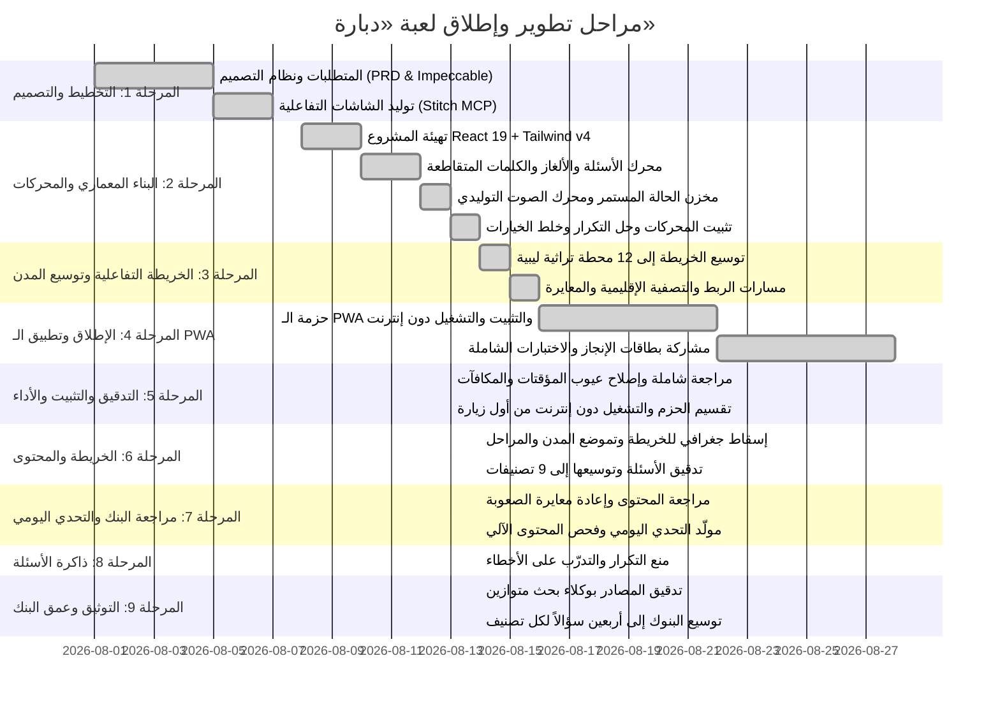

# خارطة طريق مشروع لعبة «دبارة» (Roadmap)

---

## 🎯 حالة المعالم والمراحل (Milestone Progress)

---

### 🟢 المنجز بالكامل والمثبت (Solidified & Completed)
- [x] وثيقة متطلبات المنتج [prd.md](file:///c:/Users/masal/Documents/opencode/trivia-game/prd.md).
- [x] نظام التصميم المتكامل (Modern Libyan Neo-Heritage) في [design.md](file:///c:/Users/masal/Documents/opencode/trivia-game/design.md).
- [x] تهيئة بيئة العمل React 19 + TypeScript + Tailwind CSS v4 + Vite 6 مع تقسيم الحزم الذكي (`manualChunks`).
- [x] **توسيع خريطة ليبيا الجغرافية إلى 12 محطة تراثية كاملة**:
  - طرابلس، لبدة وصبراتة، نالوت وجبل نفوسة، مصراتة، بنغازي، شحات والجبل الأخضر، درنة، واحات جالو وأوجلة، غدامس، سبها وجرمة، غات وأكاكوس، والكفرة والعوينات.
- [x] **مسارات الربط الجغرافي المنحنية بدقة** على يابسة ليبيا مع دعم تصفية الأقاليم الأربعة في [LibyaVectorMap.tsx](file:///c:/Users/masal/Documents/opencode/trivia-game/src/features/map/LibyaVectorMap.tsx).
- [x] **حل مشكلة تكرار الأسئلة جذرياً وتخصيص أسئلة ومراحل فريدة لكافة المدن الـ 12**.
- [x] **تطبيق خلط الخيارات العشوائي (Fisher-Yates Shuffle)** في [QuizScreen.tsx](file:///c:/Users/masal/Documents/opencode/trivia-game/src/features/quiz/QuizScreen.tsx).
- [x] **بنك سباق السرعة (Speed Blitz)** بـ 30+ سؤالاً متنوعاً واختيار 10 أسئلة عشوائية في [SpeedBlitz.tsx](file:///c:/Users/masal/Documents/opencode/trivia-game/src/features/quiz/SpeedBlitz.tsx).
- [x] **تصحيح شبكات الكلمات المتقاطعة وتوسيعها** في [crosswords.ts](file:///c:/Users/masal/Documents/opencode/trivia-game/src/data/puzzles/crosswords.ts).
- [x] **ترقية اللعب السريع (Category Hub)** لدعم جولات متكاملة من 5 أسئلة متتالية مع شريط تقدم وملخص مكافآت.
- [x] **دمج الاهتزازات اللمسية التفاعلية (Haptics Feedback)** في [soundEffects.ts](file:///c:/Users/masal/Documents/opencode/trivia-game/src/audio/soundEffects.ts) لكافة الأزرار والإجابات والعملات.
- [x] **نظام التصدير والاستيراد الشامل الموحد للحفظ** في [SettingsModal.tsx](file:///c:/Users/masal/Documents/opencode/trivia-game/src/components/SettingsModal.tsx).
- [x] **تطبيق ويب تقدمي كامل (100% Offline PWA)** عبر `manifest.webmanifest` ومحرك التخزين المؤقت `sw.js`.
- [x] **توليد ومشاركة بطاقات الإنجاز المصورة عالية الدقة** بواسطة Canvas و Web Share API في [ShareResultModal.tsx](file:///c:/Users/masal/Documents/opencode/trivia-game/src/components/ShareResultModal.tsx).
- [x] **وضع التحدي الثنائي المحلي (2-Player Pass & Play)** بجولات وتناوب مباشر وشاشة تتويج في [PassAndPlayScreen.tsx](file:///c:/Users/masal/Documents/opencode/trivia-game/src/features/multiplayer/PassAndPlayScreen.tsx).
- [x] **الرتب والسجل الشخصي** في [LeaderboardTab.tsx](file:///c:/Users/masal/Documents/opencode/trivia-game/src/features/badges/LeaderboardTab.tsx).

---

---

### 🛠️ المرحلة 5: مراجعة شاملة وتثبيت (2026-08-13)

مراجعة كاملة لكل ما أُنجز في المراحل السابقة، مع اختبار فعلي في المتصفح لكل نمط لعب.

**عيوب جوهرية في اللعب تم إصلاحها:**
- [x] **جولة اللعب السريع كانت معطلة**: لم تكن `QuizScreen` تُعطى `key`، فكان السؤال الثاني وما بعده يظهر وقد "أُجيب" مسبقاً مع كشف الإجابة وتجمّد المؤقت.
- [x] **محرك مؤقت موحد** [useCountdown.ts](file:///c:/Users/masal/Documents/opencode/trivia-game/src/hooks/useCountdown.ts) مبني على وقت نهاية مطلق. المؤقتات الثلاثة السابقة كانت تستدعي آثاراً جانبية داخل `setState` (تتضاعف تحت `StrictMode`) وتُعيد إنشاء الـ interval كل ثانية.
- [x] **سباق السرعة كان يدفع المكافأة مرتين**: انتهاء الوقت وآخر إجابة كانا يُنهيان الجولة معاً؛ صار التسوية محكومة بقفل واحد. كما مُنع تكرار الإجابة خلال نافذة الكشف (280 مللي ثانية).
- [x] **التحدي الثنائي كان يُعيد ترتيب بنوك الأسئلة الأصلية** بالخلط في مكانها (`pool = historyQuestions`) فيؤثر على كل الشاشات؛ صار الخلط على نسخة.
- [x] **مساعدة التخطي كانت تُحتسب إجابة صحيحة كاملة** (3 نجوم + دنانير + رفع نسبة الدقة) مقابل 40 ديناراً؛ صارت تجتاز المرحلة بنجمة واحدة دون مكافأة ودون احتسابها إجابة.
- [x] **زر المكافأة اليومية كان بلا أثر**: كان التطبيق يستهلك المكافأة تلقائياً عند الإقلاع، فيظل الزر يَعِد بشيء لا يمنحه. صار الاستلام بيد اللاعب ومحفوظاً بالتاريخ ولا يتكرر بإعادة التحميل.
- [x] **ملخص الجولة كان يعرض 3 نجوم و50 ديناراً دائماً** بغض النظر عن الأداء؛ صار يعتمد على عدد الإجابات الصحيحة الفعلي.

**إعدادات كانت معروضة دون أن تعمل:**
- [x] `hapticsEnabled` لم يكن يُقرأ إطلاقاً في محرك الصوت — الاهتزاز يعمل دائماً؛ وأُضيف مفتاح التحكم به في الإعدادات.
- [x] كتم الصوت لم يكن يُطبَّق بعد إعادة التحميل (`sfx.setMuted` لم يُستدعَ عند استرجاع الحفظ).

**الأداء والحزم:**
- [x] تقسيم الشاشات الثقيلة بـ `React.lazy` وفهرسة الأسئلة في `Map` بدل دمج خمسة بنوك ومسحها خطياً في كل رسم.
- [x] إصلاح `manualChunks`: كان `react-dom` يتسرب إلى الحزمة الرئيسية لأن التطبيق يستورد `react-dom/client`. **الحزمة الرئيسية: 285.7 ك.ب ← 104.3 ك.ب** (86.5 ← 30.0 ك.ب مضغوطة).

**تطبيق الويب التقدمي (PWA) — كان يفشل دون إنترنت:**
- [x] توليد قائمة الأصول المُجزّأة وقت البناء وحقنها في `sw.js`؛ قبلها كانت ملفات JS/CSS تُطلب قبل تولّي العامل السيطرة فلا تُخزَّن، فتفشل أول زيارة دون إنترنت.
- [x] `ignoreVary` عند مطابقة الذاكرة المؤقتة: خوادم ترد بـ `Vary: Origin` كانت تُفشل مطابقة كل أصل.
- [x] الانتقالات بإستراتيجية الشبكة أولاً (كانت الذاكرة أولاً فيتأخر أي تحديث إصدارًا كاملاً)، واسم ذاكرة مؤقتة موسوم ببصمة البناء.
- [x] منع تسجيل العامل على خادم التطوير حيث كان يخزّن وحدات Vite ويجمّد التعديلات.

**دقة الخريطة الجغرافية:**
- [x] **مواضع الدبابيس كانت نسباً مئوية مضبوطة يدوياً وتنحرف حتى 13 نقطة مئوية**؛ مدن الجنوب (غات، سبها، الكفرة، جالو) كانت مرسومة أسفل مساحة ليبيا الفعلية.
- [x] المدن صارت تحمل **إحداثيات جغرافية حقيقية**، ويحوّلها إسقاط Mercator معاير في [projection.ts](file:///c:/Users/masal/Documents/opencode/trivia-game/src/features/map/projection.ts) — عُوير بقياس حدّ ليبيا في الصورة برمجياً وتحقق منه مقابل الخط الساحلي المرسوم عند 7 مدن ساحلية (ضمن ~1.5 بكسل).
- [x] طبقة الدبابيس تعيد إنتاج هندسة `object-cover` تماماً، فتبقى مطابقة عند أي عرض شاشة (خطأ < 0.1 بكسل عند 360/430/500/768).
- [x] المسارات تُولَّد من أزواج المدن فتنتهي دائماً عند الدبابيس؛ ومسار خليج سرت صار يتبع الشاطئ بدل قطع المياه المفتوحة.
- [x] تسميات مختصرة على الدبابيس مع إزاحات موضوعة يدوياً، لأن الإحداثيات الحقيقية تجعل مدن الساحل متلاصقة وتسمياتها تتراكب.
- [x] **مراحل المدينة صارت تتفتّح كعقد حول دبوسها على الخريطة** بدل قائمة مسطّحة داخل نافذة منفصلة؛ مواضعها مشتقّة ببحث على الاتجاه ونصف القطر وعرض المروحة في [stageLayout.ts](file:///c:/Users/masal/Documents/opencode/trivia-game/src/features/map/stageLayout.ts)، ويتجنّب الحواف ودبابيس الجيران وتسمياتهم وتراكب العقد. تم التحقق آلياً من كل المدن الاثنتي عشرة.

**سهولة الوصول واللمس:**
- [x] اسم المدينة تحت الدبوس كان `pointer-events-none` فلا يستجيب للنقر؛ صار جزءاً من هدف اللمس.
- [x] بطاقات التصنيفات ولافتة التحدي الثنائي صارت `<button>` حقيقية (كانت `
` قابلة للنقر تحوي أزراراً بداخلها).
- [x] إغلاق النوافذ بـ Escape وبالنقر على الخلفية، مع `role="dialog"`.
- [x] بطاقة المشاركة صارت صادقة: المبارزة الثنائية كانت تعرض "⭐⭐⭐" و"+50 د.ل" لتعادل 0-0 لا يمنح شيئاً.

---

### 📚 المرحلة 6: تدقيق بنك الأسئلة وتوسيعه (2026-08-14)

**من 41 سؤالاً و5 تصنيفات إلى 180 سؤالاً و9 تصنيفات، و50 عبارة لسباق السرعة.**

- [x] **العيب الأخطر لم يكن في المعلومات بل في البدائل**: أسئلة مصنفة «صعبة» كانت بدائلها "برج إيفل الرخامي" و"قصر فرساي" و"سور الصين"، وأسئلة طعام بدائلها "السوشي" و"التاكو" — فكان التصنيف بلا معنى. استُبدلت كل البدائل غير المعقولة ببدائل من نفس المجال (قصور ليبية أخرى، مدن جبل نفوسة الحقيقية، أسماء مدن أثرية، أطباق ليبية)، ثم أُعيدت معايرة الصعوبة والمكافأة.
- [x] **سؤالان كانا يحويان إجابتهما** في نص السؤال، فأُعيدت صياغتهما.
- [x] **تصحيحات واقعية**: طول الساحل الليبي (1,970 ← 1,770 كم)، وارتفاع قمة بتة، وتاريخ بناء مسجد العتيق بأوجلة، ووصف "الروينة"، واسم وادي الجبل الأخضر.
- [x] **ما لا يمكن التحقق منه يُحذف لا يُخمَّن**: أُزيل لقب لاعب وجائزته لعدم إمكان توثيقهما، واستُبدل بسؤال عن نتيجة نهائي 1982 القابلة للتحقق.
- [x] **كل الأسئلة كانت إجابتها في الموضع الأول** (`correctIndex: 0`). لم يكن ذلك مستغلاً لأن الخيارات تُخلط وقت العرض، لكنه جعل البيانات هشة؛ صارت المواضع متنوعة.
- [x] **سباق السرعة كان مائلاً** 25 صح مقابل 17 خطأ، فالضغط الدائم على "صح" يربح 59% — صار التوازن 25/25.
- [x] **أربعة تصنيفات عامة جديدة**: جغرافيا، دين وحضارة إسلامية، لغة وأدب عربي، علوم وطبيعة — نشأت من تفكيك بنك «ثقافة عامة» الذي كان خليطاً غير متجانس، ثم توسعتها. وأُدرجت كلها في صالة التصنيفات وفي منتقي التحدي الثنائي الذي كان لا يعرض إلا أربعة تصنيفات.
- [x] **فحص آلي للمحتوى** يضمن: تفرد المعرفات، أربعة خيارات متمايزة، خلو السؤال من إجابته، مطابقة المكافأة للصعوبة، ألا يقل بنك عن ضعف طول الجولة، وصحة كل مرجع `questionId` في المراحل والتحديات اليومية.

---

### 🗺️ إضافة مسلاتة وفضّ ازدحام الخريطة (2026-08-14)

- [x] **أُضيفت مدينة مسلاتة** (المرقب) بإحداثياتها الحقيقية، بأربع مراحل وسؤالين ولغز حروف جديد، ومُدرجت في مسار الطريق الساحلي بين طرابلس ولبدة.
- [x] **كشفت الإضافة عيباً قائماً**: مسلاتة تبعد عن لبدة نحو 25 كم فقط، أي **4 بكسلات** بمقياس الخريطة — وقد كانت طرابلس ولبدة ومصراتة متداخلة أصلاً قبل إضافتها.
- [x] **فضّ ازدحام الدبابيس بالاسترخاء التكراري**: تنافر يفصل المتداخلين وتجاذب يعيدهم نحو مواضعهم الحقيقية، مع نقطة مرساة وخط رفيع يشيران للموقع الفعلي عند الإزاحة. النتيجة: لا تداخل، بمتوسط إزاحة 3.8 بكسل، ومدن الصحراء لا تتحرك إطلاقاً.
- [x] تصغير رمز المدينة لتقليل الإزاحة المطلوبة، وإعادة ضبط تسميات لبدة ومصراتة ونالوت بعد تغيّر المواضع.
- [x] **إصلاح تعارض**: كانت المسارات لا تزال تُرسم إلى المواضع الحقيقية بينما انتقلت الدبابيس، فصارت الطرق معلّقة في الفراغ.

---

### 🧭 توسعة الخريطة والقائمة الرئيسية (2026-08-14)

- [x] **الخريطة من 13 إلى 20 محطة**: أُضيفت زوارة، غريان، سرت، أجدابيا، طبرق، الجغبوب، ومرزق — بتغطية أوسع للأقاليم الأربعة، ولكل منها إحداثياتها الحقيقية وأسئلتها وألغازها ورمزها الخاص، ومُدرجة في شبكة المسارات (الطريق الساحلي صار يمر بسرت وأجدابيا وطبرق، والدرب الغربي بغريان ومرزق).
- [x] **مراحل إضافية للمدن القائمة**: قوس ماركوس أوريليوس لطرابلس، وحمامات هادريان للبدة، وواحات الكفرة — ليصبح المجموع 77 مرحلة.
- [x] **تموضع التسميات صار آلياً** في [labelLayout.ts](file:///c:/Users/masal/Documents/opencode/trivia-game/src/features/map/labelLayout.ts): مع عشرين مدينة لم تعد الإزاحات المكتوبة يدوياً تنفع، لأن الدبابيس نفسها تتحرك في خطوة فضّ الازدحام. الحل يبحث في مواضع مرشحة حول كل دبوس ويختار أبعدها عن الدبابيس والتسميات الموضوعة. **تراكب التسمية فوق دبوس صار صفراً** (كان بينها حالات تصل إلى 320 بكسل²)، ولم يبق سوى تلامس أركان لا يتجاوز 6% من مساحة التسمية.
- [x] **تحسين شكل الخريطة**: حلقة تقدّم حول كل دبوس تُظهر نسبة نجومه المكتسبة (وتتحول للأخضر عند الإتمام)، وشريط تقدّم أسفل الخريطة يعرض المدن المفتوحة وإجمالي النجوم.
- [x] **قائمة رئيسية جديدة** [MainMenuScreen.tsx](file:///c:/Users/masal/Documents/opencode/trivia-game/src/features/menu/MainMenuScreen.tsx): شاشة بداية بشعار اللعبة وملخص التقدم ومداخل مباشرة لكل نمط، مع مؤشر أخضر على تحدي اليوم حين يكون متاحاً. زر الملف في الشريط العلوي يعيد إليها.

> **ملاحظة على الاسترخاء التكراري:** جُرّب ترتيب المدن الأكثر ازدحاماً أولاً في حل التسميات، فأعطى نتيجة **أسوأ** قياساً (4 تراكبات مقابل 3)، فأُسقطت الفكرة بدل الاحتفاظ بتعقيد لا يؤتي ثمرة.

---

### 🏅 الرتب الحقيقية وإزالة الخصوم الوهميين (2026-08-14)

- [x] **لوحة الشرف كانت تعرض سبعة لاعبين مُختلقين** بأسماء ونقاط وهمية معروضة كأنها منافسون حقيقيون. المقارنة بين اللاعبين تحتاج خادماً مخططاً وغير موجود، واختلاق خصوم في الأثناء يناقض مبدأً مسجّلاً في [PRODUCT.md](file:///c:/Users/masal/Documents/opencode/trivia-game/PRODUCT.md): **لا تُعرض بيانات مُختلقة كأنها حقيقية**.
- [x] **عيب ثانٍ كشفه الأول**: حقل `profile.title` كان يُضبط مرة واحدة عند البداية ولا يتغيّر أبداً، فالرتبة معروضة في الشريط العلوي وبطاقة المشاركة ولا يمكن للاعب أن يتقدم فيها إطلاقاً.
- [x] **سلّم رتب حقيقي** في [ranks.ts](file:///c:/Users/masal/Documents/opencode/trivia-game/src/data/ranks.ts): ست رتب من «مستكشف مبتدئ» إلى «شيخ الدبارة»، والنقطة التنافسية صارت لها **تعريف واحد** بعد أن كانت صيغة مكتوبة داخل المكوّن لا يعرفها سواه.
- [x] **معايرة العتبات على حجم اللعبة الفعلي**: أول صياغة كانت تتوّج اللاعب عند 2000 نقطة، أي بعد ثلث الخريطة تقريباً؛ الخريطة تحوي 231 نجمة تساوي وحدها 8085 نقطة. العتبات الحالية تجعل أعلى رتبة تُبلغ عند **~61% من الإتمام**.
- [x] التبويب صار «رتبتي» ويعرض **سجل اللاعب وحده**: رتبته وتقدمه للرتبة التالية، وصيغة النقاط معلنة لا مخفية، وأرقامه القياسية (أفضل سباق، أطول سلسلة، الدقة، النجوم، المدن، الأسئلة)، وسلّم الرتب، مع إشارة صريحة إلى أن المقارنة مع الآخرين تنتظر الخادم.

---

### 🔍 المرحلة 7: مراجعة بنك الأسئلة وتوليد التحدي اليومي (2026-08-14)

**مراجعة كاملة للمحتوى، ثم أدوات تمنع تكرار ما صُحّح.**

- [x] **تصحيحات واقعية**: ملف الكسكسي في اليونسكو 2020 قدمته الجزائر وموريتانيا والمغرب وتونس ولم تكن ليبيا ضمنه؛ و«اللوغاريتم» لا يُشتق من الخوارزمي (المشتق هو algorithm)؛ وكأس آسيا (1956) أقدم من كأس أفريقيا (1957) فترتيب الأقدمية كان خاطئاً.
- [x] **سؤال بإجابتين مقبولتين**: `food_trad_09` كان يعرض «الفتات» و«المثرودة» معاً ونصه يصف كليهما.
- [x] **صياغات تنتهي صلاحيتها**: «الدولة الأفريقية الوحيدة التي استضافت المونديال» تبطل سنة 2030، و«أكبر حقل نفطي» متنازع عليه.
- [x] **إعادة معايرة الصعوبة على كل البنك**: من 49/94/48/4 إلى 67/74/40/14 (سهل/متوسط/صعب/خبير)، والمكافآت أُعيدت إلى سلّم 25 / 30-35 / 40-45 / 50. الجدول مكتوب صراحةً في [questions-rebalance.mjs](file:///c:/Users/masal/Documents/opencode/trivia-game/scripts/questions-rebalance.mjs) لا موزعاً على تعديلات متفرقة.
- [x] **موقع الإجابة عاد إلى الانحراف**: 97 من 195 سؤالاً كانت إجابتها في الموضع الثاني وستة فقط في الرابع. الخيارات تُخلط وقت العرض فلم يكن مستغلاً، لكنه يخالف القاعدة الخامسة في `generalArab.ts`. صار 56/56/54/53، مع التحقق من أن كل إجابة صحيحة بقيت كما هي.
- [x] **+24 سؤالاً** للتصنيفات الأنحف (أدب، ثقافة عامة، إسلامية، علوم، جغرافيا) — المجموع 219. وأُسقط ما لم يُوثَّق بدل تخمينه.
- [x] **الكلمات المتقاطعة من 3 إلى 18**، مع قاعدتين صارتا مفروضتين آلياً: تغطية كل خانة بدليل، وحصر الحروف فيما تنتجه لوحة مفاتيح اللعبة (لا أ ولا إ ولا آ).
- [x] **التحدي اليومي صار مولَّداً من التاريخ** بدل ثلاثة تحديات بتواريخ ثابتة انتهت صلاحيتها وصارت تدور على نفسها إلى الأبد. دالة نقية بلا حالة مخزّنة، بنمط أسبوعي من أربعة أنماط، ولا تتكرر مجموعة قبل استنفادها (قيست على 800 يوم: أول تكرار سؤال بعد 341 يوماً، ولغز بعد 119).
- [x] **عيب كامن أُصلح قبل أن يظهر**: سؤال التحدي اليومي كان يُحل من بنك اللهجات وحده، فأي سؤال من التصنيفات الثمانية الأخرى كان سيُخدَّم صامتاً بـ `dialectQuestions[0]`. أُنشئ فهرس مشترك في [data/questions/index.ts](file:///c:/Users/masal/Documents/opencode/trivia-game/src/data/questions/index.ts).
- [x] **الفحص الآلي للمحتوى صار موجوداً فعلاً**: كان مذكوراً في هذه الوثيقة ضمن المنجز ولا وجود له في المستودع. صار `npm run questions:check` جزءاً من `npm run build`، فلا يمكن إصدار نسخة ببنك مكسور. وقد التقط فوراً سؤالاً يحوي إجابته أُدخل أثناء المراجعة نفسها.
- [x] **صفحة مراجعة تفاعلية** يولّدها `npm run questions:export` للتحرير والتصفية والتصدير.

---

### 🧠 المرحلة 8: ذاكرة الأسئلة والتدرّب على الأخطاء (2026-08-14)

- [x] **المخزن كان يحفظ عدّادات فقط**: `recordQuestionAnswer(isCorrect)` يزيد رقمين ولا يعرف أي سؤال عُرض أو أُخطئ فيه، فلم يكن ممكناً منع التكرار ولا بناء أي مراجعة. صار يسجّل `seenQuestionIds` و`missedQuestionIds`، وكلاهما مصمم ليُزامن مع الخادم لاحقاً.
- [x] **منع التكرار في اللعب السريع**: كانت الجولة تسحب 5 أسئلة عشوائية من البنك كاملاً في كل مرة، فيتكرر السؤال بعد جولتين أو ثلاث. صارت تُقدّم غير المرئي أولاً ولا ترجع لسؤال قبل استنفاد التصنيف. مقاس فعلياً على بنك الإسلاميات (21 سؤالاً): **21 سؤالاً متمايزاً قبل أي تكرار** بدل تكرار داخل الجولة الثانية.
- [x] **نمط «تدرّب على أخطائك»**: جولة تُبنى من الأسئلة التي أخطأ فيها اللاعب عبر كل التصنيفات، ولا يخرج السؤال من القائمة إلا بإجابة صحيحة. لافتته لا تظهر إلا حين يكون فيها شيء فعلاً.

---

### 📖 المرحلة 9: التوثيق وعمق البنك (2026-08-14)

**من 237 إلى 343 سؤالاً، وثمانية تصنيفات من التسعة بلغت هدف الأربعين.**

- [x] **حقل `source` للأسئلة**: مرجع مسمّى (كتاب أو جهة أو سورة وآية) لا رابطاً، ليبقى قابلاً للتحقق دون إنترنت ولا يتعفّن. و**73 سؤالاً موثّق** اليوم، أولويتها أسئلة «صعب» و«خبير» وكل رقم أو تفضيل.
- [x] **حقل `needsReview`**: يحمل **سبب** الشك لا مجرد وجوده، وله تصفية خاصة في صفحة المراجعة.
- [x] **خمس جولات تدقيق آلي بالبحث** عبر Antigravity CLI على Gemini 3.7 Flash، ثلاث منها متوازية. الحصيلة الحقيقية: تصحيح «رأس الرمل ← رأس زروق» بمصراتة، وكشف تبادل وصفَي «الفتات» و«المثرودة»، وتصحيح رقم إنتاج حقل الشرارة، وإعادة صياغة سؤال التقسيم الإداري لمسلاتة بعد إلغاء الشعبيات.
- [x] **حكم على الأداة نفسها**: أحكامها غير صالحة للاعتماد — أكّدت في جولتين أسئلةً كان اقتباسها هو نفسه يناقضها، وأسندت 14 استشهاداً إلى جهات لم تفتح صفحاتها. ما جعلها مفيدة هو **اشتراط اقتباس حرفي** يذكر الادعاء نفسه لا موضوعه، ثم قراءة كل اقتباس مقابل ادعائه يدوياً. بلا ذلك تُنتج تلفيقاً واثقاً.
- [x] **توسيع البنوك**: تاريخ 40، لهجات 40، رياضة 40، ثقافة عامة 40، جغرافيا 40، إسلامية 40، أدب 40، علوم 40 — والمطبخ 23 موقوف على حسم وصف «المثرودة».

**العيب المعروف أُغلق:** كان الفحص يقارن السؤال بإجابته هو لا ببقية البنك. صار يرصد تسرّب الإجابة بين الأسئلة، وسيأتي تفصيله في المرحلة 10.

---

## 🧭 المرحلة 10 — الخريطة والاقتصاد والتسريب (مكتملة)

بعد نشر اللعبة ولعبها فعلياً، جاءت الملاحظات من التجربة لا من التخطيط: تكرار الأسئلة، وازدحام الخريطة، ومدن بلا عمق، ودنانير بلا معنى، ونجوم بلا استحقاق.

**الخريطة**
- [x] **تكبير وتصغير حتى 4×** بالعجلة والإصبعين والأزرار والنقر المزدوج. الرموز تحافظ على حجمها على الشاشة، فتُخبَر خوارزميات التوزيع بالتكبير وتطلب فاصلاً أقل.
- [x] **حدّ أعلى لكذب الدبوس**: كان الفصل المطلوب 28 بكسل، أي 180 كم على الأرض — وليبيا الساحلية أضيق من ذلك. النتيجة كانت لبدة على بعد 121 كم من موضعها وطرابلس 97. صار الفاصل تفضيلاً والإزاحة قانوناً: لا يتجاوز أي دبوس 6 بكسل (نحو 39 كم)، ويصل إلى الصفر عند 4×. يُقاس بـ `npm run map:audit`.
- [x] **تفاصيل الرمز تتبع التكبير**: الدبوس نصف حجمه دون 2×، لأن دبوساً كامل الحجم لا يمكنه إلا أن يغطي جاره — وقد كان النقر على طرابلس يختار غريان.
- [x] **إسقاط الأسماء المتزاحمة** بدل تكديسها، كما تفعل الخرائط المطبوعة: 19 اسماً عند العرض الكامل و26 عند 4×، بلا أي تداخل. وقد لزم أولاً تصحيح تقدير حجم الاسم — كان الارتفاع 12 بكسل والحقيقي 19.6.
- [x] **إلغاء التحديد بنقرة خارج المدينة**، مع تمييز النقرة عن نهاية السحب.
- [x] **ست مدن جديدة**: الزاوية، زليتن، بني وليد، المرج، الجفرة، أوباري — بتسعة أسئلة جديدة وطرق قوافل تمرّ بها لا فوقها.

**المحتوى والتكرار**
- [x] **مراحل الخريطة لم تعد تسأل السؤال نفسه أبداً**: السؤال المنسّق تفضيل لا قيد، ثم تُسحب أسئلة غير مرئية من المدينة نفسها فمن الموضوع نفسه. اثنتا عشرة إعادة تعطي اثني عشر سؤالاً مختلفاً في كل مدينة، بعد أن كانت تعطي واحداً. `npm run city:audit`.
- [x] **منحنى الجولة**: سهل، سهل، متوسط، متوسط، صعب. الجولات التي تفتح بسؤال صعب: من 22% إلى صفر. `npm run round:audit`.
- [x] **إعادة كتابة 31 عبارة من سباق السرعة** كانت تعيد صياغة أسئلة قائمة فتكشف إجاباتها، مع الحفاظ على توازن 25/25. قائمة التسريب: من 111 زوجاً إلى 74، ولم يبقَ فيها أي تسريب من سباق السرعة.
- [x] **123 تلميحاً** لكل الأسئلة الصعبة والخبيرة إلا واحداً، يُشترى بـ30 ديناراً ويُضيّق دون كشف. والفحص يشمل التلميح في نص التسريب — وقد أمسك فوراً ستة تلميحات كانت تكشف أسئلة أخرى.
- [x] **المعلومة تُكتسب**: لا تظهر «معلومة ع الماشي» إلا عند الإجابة الصحيحة.

**الاقتصاد**
- [x] **فارق ستة أضعاف بين السهل والخبير** بدل ضعفين: 10 و20 و35 و60.
- [x] **الجولة الكاملة 120 ديناراً** بعد أن كانت تتجاوز 250، والمساعدات من 45 إلى 120، والتحدي اليومي من 30 إلى 60، والسلسلة تتوقف عند 80.
- [x] **النجوم تُستحق**: النجمتان تحتاجان أربعاً من خمس لا ثلاثاً، والنجوم الثلاث في المرحلة تحتاج إجابة خلال ست ثوانٍ لا عشر.
- [x] **متجر**: ثمانية رموز وأربعة ألقاب وفتح مدينة مقفلة بالدنانير. واللقب المُشترى يحتاج مكاناً خاصاً به لأن `refreshRank` يكتب الرتبة المكتسبة فوق أي شيء آخر.

**بند مفتوح:** 74 زوج تسريب بين سؤال وسؤال، و47 سؤالاً صعباً بلا مصدر، وعمق المدن (بني وليد ما زالت بسؤال واحد خاص بها).

---

### 🚀 حالة المشروع (Project Status: Production Ready)

كافة معالم المراحل الست مكتملة، وتم التحقق من كل أنماط اللعب فعلياً في المتصفح (الخريطة، اللعب السريع، سباق السرعة، الكلمات المتقاطعة، ترتيب الحروف، التحدي الثنائي، التحدي اليومي، الإعدادات، بطاقة المشاركة) دون أي أخطاء في الطرفية، مع إقلاع كامل دون إنترنت من أول زيارة.

**أرقام المحتوى الحالية:**

| المحتوى | العدد |
| --- | --- |
| أسئلة الاختيار من متعدد | 356 سؤالاً في 9 تصنيفات |
| عبارات سباق السرعة | 50 عبارة (25 صح / 25 خطأ) |
| محطات الخريطة | 26 مدينة بإحداثيات جغرافية حقيقية |
| مراحل اللعب | 95 مرحلة موزعة على المدن |
| ألغاز ترتيب الحروف | 30 لغزاً |
| شبكات الكلمات المتقاطعة | 18 شبكة |
| أسئلة موثّقة بمصدر | 83 سؤالاً |
| أسئلة بتلميح | 123 من 124 صعباً وخبيراً |
| أزواج تسريب مؤجلة | 74 (كانت 111) |
| التحديات اليومية | مولَّدة من التاريخ، أربعة أنماط |

**اللعبة منشورة** على Cloudflare مع اختبارات Playwright في CI تفحص المحتوى والخريطة والبناء عند كل دفعة.

**نقاط تحتاج مراجعة محلية:** بنود ليبية دقيقة تنتظر مطلعاً محلياً، وهي مسجّلة بمعرفاتها في [improvement-plan.md](file:///c:/Users/masal/Documents/opencode/trivia-game/improvement-plan.md): «رأس الرمل» بمصراتة، ولقب «الفحامة» لنادي النصر بنغازي، وحقل الشرارة بوصفه الأكثر إنتاجاً، ولقب «شاعر الوطن» لأحمد رفيق المهدوي، وصياغات الأمثال الشعبية ورواياتها المختلفة بين المناطق.

