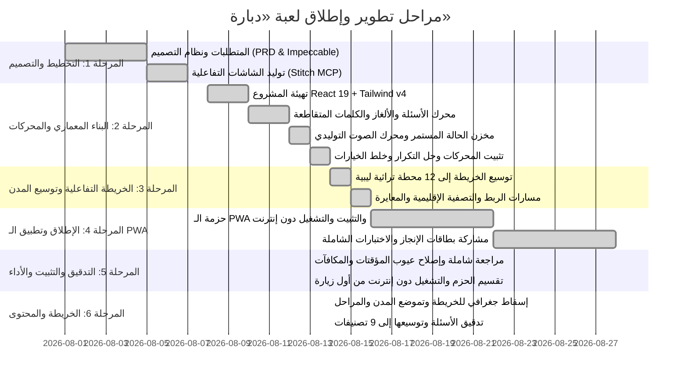

# خارطة طريق مشروع لعبة «دبارة» (Roadmap)

---

## 🎯 حالة المعالم والمراحل (Milestone Progress)

---

### 🟢 المنجز بالكامل والمثبت (Solidified & Completed)
- [x] وثيقة متطلبات المنتج [prd.md](file:///c:/Users/masal/Documents/opencode/trivia-game/prd.md).
- [x] نظام التصميم المتكامل (Modern Libyan Neo-Heritage) في [design.md](file:///c:/Users/masal/Documents/opencode/trivia-game/design.md).
- [x] تهيئة بيئة العمل React 19 + TypeScript + Tailwind CSS v4 + Vite 6 مع تقسيم الحزم الذكي (`manualChunks`).
- [x] **توسيع خريطة ليبيا الجغرافية إلى 12 محطة تراثية كاملة**:
  - طرابلس، لبدة وصبراتة، نالوت وجبل نفوسة، مصراتة، بنغازي، شحات والجبل الأخضر، درنة، واحات جالو وأوجلة، غدامس، سبها وجرمة، غات وأكاكوس، والكفرة والعوينات.
- [x] **مسارات الربط الجغرافي المنحنية بدقة** على يابسة ليبيا مع دعم تصفية الأقاليم الأربعة في [LibyaVectorMap.tsx](file:///c:/Users/masal/Documents/opencode/trivia-game/src/features/map/LibyaVectorMap.tsx).
- [x] **حل مشكلة تكرار الأسئلة جذرياً وتخصيص أسئلة ومراحل فريدة لكافة المدن الـ 12**.
- [x] **تطبيق خلط الخيارات العشوائي (Fisher-Yates Shuffle)** في [QuizScreen.tsx](file:///c:/Users/masal/Documents/opencode/trivia-game/src/features/quiz/QuizScreen.tsx).
- [x] **بنك سباق السرعة (Speed Blitz)** بـ 30+ سؤالاً متنوعاً واختيار 10 أسئلة عشوائية في [SpeedBlitz.tsx](file:///c:/Users/masal/Documents/opencode/trivia-game/src/features/quiz/SpeedBlitz.tsx).
- [x] **تصحيح شبكات الكلمات المتقاطعة وتوسيعها** في [crosswords.ts](file:///c:/Users/masal/Documents/opencode/trivia-game/src/data/puzzles/crosswords.ts).
- [x] **ترقية اللعب السريع (Category Hub)** لدعم جولات متكاملة من 5 أسئلة متتالية مع شريط تقدم وملخص مكافآت.
- [x] **دمج الاهتزازات اللمسية التفاعلية (Haptics Feedback)** في [soundEffects.ts](file:///c:/Users/masal/Documents/opencode/trivia-game/src/audio/soundEffects.ts) لكافة الأزرار والإجابات والعملات.
- [x] **نظام التصدير والاستيراد الشامل الموحد للحفظ** في [SettingsModal.tsx](file:///c:/Users/masal/Documents/opencode/trivia-game/src/components/SettingsModal.tsx).
- [x] **تطبيق ويب تقدمي كامل (100% Offline PWA)** عبر `manifest.webmanifest` ومحرك التخزين المؤقت `sw.js`.
- [x] **توليد ومشاركة بطاقات الإنجاز المصورة عالية الدقة** بواسطة Canvas و Web Share API في [ShareResultModal.tsx](file:///c:/Users/masal/Documents/opencode/trivia-game/src/components/ShareResultModal.tsx).
- [x] **وضع التحدي الثنائي المحلي (2-Player Pass & Play)** بجولات وتناوب مباشر وشاشة تتويج في [PassAndPlayScreen.tsx](file:///c:/Users/masal/Documents/opencode/trivia-game/src/features/multiplayer/PassAndPlayScreen.tsx).
- [x] **لوحة الشرف الأسبوعية والمواسم التنافسية** مع تصنيف كبار المستكشفين في [LeaderboardTab.tsx](file:///c:/Users/masal/Documents/opencode/trivia-game/src/features/badges/LeaderboardTab.tsx).

---

---

### 🛠️ المرحلة 5: مراجعة شاملة وتثبيت (2026-08-13)

مراجعة كاملة لكل ما أُنجز في المراحل السابقة، مع اختبار فعلي في المتصفح لكل نمط لعب.

**عيوب جوهرية في اللعب تم إصلاحها:**
- [x] **جولة اللعب السريع كانت معطلة**: لم تكن `QuizScreen` تُعطى `key`، فكان السؤال الثاني وما بعده يظهر وقد "أُجيب" مسبقاً مع كشف الإجابة وتجمّد المؤقت.
- [x] **محرك مؤقت موحد** [useCountdown.ts](file:///c:/Users/masal/Documents/opencode/trivia-game/src/hooks/useCountdown.ts) مبني على وقت نهاية مطلق. المؤقتات الثلاثة السابقة كانت تستدعي آثاراً جانبية داخل `setState` (تتضاعف تحت `StrictMode`) وتُعيد إنشاء الـ interval كل ثانية.
- [x] **سباق السرعة كان يدفع المكافأة مرتين**: انتهاء الوقت وآخر إجابة كانا يُنهيان الجولة معاً؛ صار التسوية محكومة بقفل واحد. كما مُنع تكرار الإجابة خلال نافذة الكشف (280 مللي ثانية).
- [x] **التحدي الثنائي كان يُعيد ترتيب بنوك الأسئلة الأصلية** بالخلط في مكانها (`pool = historyQuestions`) فيؤثر على كل الشاشات؛ صار الخلط على نسخة.
- [x] **مساعدة التخطي كانت تُحتسب إجابة صحيحة كاملة** (3 نجوم + دنانير + رفع نسبة الدقة) مقابل 40 ديناراً؛ صارت تجتاز المرحلة بنجمة واحدة دون مكافأة ودون احتسابها إجابة.
- [x] **زر المكافأة اليومية كان بلا أثر**: كان التطبيق يستهلك المكافأة تلقائياً عند الإقلاع، فيظل الزر يَعِد بشيء لا يمنحه. صار الاستلام بيد اللاعب ومحفوظاً بالتاريخ ولا يتكرر بإعادة التحميل.
- [x] **ملخص الجولة كان يعرض 3 نجوم و50 ديناراً دائماً** بغض النظر عن الأداء؛ صار يعتمد على عدد الإجابات الصحيحة الفعلي.

**إعدادات كانت معروضة دون أن تعمل:**
- [x] `hapticsEnabled` لم يكن يُقرأ إطلاقاً في محرك الصوت — الاهتزاز يعمل دائماً؛ وأُضيف مفتاح التحكم به في الإعدادات.
- [x] كتم الصوت لم يكن يُطبَّق بعد إعادة التحميل (`sfx.setMuted` لم يُستدعَ عند استرجاع الحفظ).

**الأداء والحزم:**
- [x] تقسيم الشاشات الثقيلة بـ `React.lazy` وفهرسة الأسئلة في `Map` بدل دمج خمسة بنوك ومسحها خطياً في كل رسم.
- [x] إصلاح `manualChunks`: كان `react-dom` يتسرب إلى الحزمة الرئيسية لأن التطبيق يستورد `react-dom/client`. **الحزمة الرئيسية: 285.7 ك.ب ← 104.3 ك.ب** (86.5 ← 30.0 ك.ب مضغوطة).

**تطبيق الويب التقدمي (PWA) — كان يفشل دون إنترنت:**
- [x] توليد قائمة الأصول المُجزّأة وقت البناء وحقنها في `sw.js`؛ قبلها كانت ملفات JS/CSS تُطلب قبل تولّي العامل السيطرة فلا تُخزَّن، فتفشل أول زيارة دون إنترنت.
- [x] `ignoreVary` عند مطابقة الذاكرة المؤقتة: خوادم ترد بـ `Vary: Origin` كانت تُفشل مطابقة كل أصل.
- [x] الانتقالات بإستراتيجية الشبكة أولاً (كانت الذاكرة أولاً فيتأخر أي تحديث إصدارًا كاملاً)، واسم ذاكرة مؤقتة موسوم ببصمة البناء.
- [x] منع تسجيل العامل على خادم التطوير حيث كان يخزّن وحدات Vite ويجمّد التعديلات.

**دقة الخريطة الجغرافية:**
- [x] **مواضع الدبابيس كانت نسباً مئوية مضبوطة يدوياً وتنحرف حتى 13 نقطة مئوية**؛ مدن الجنوب (غات، سبها، الكفرة، جالو) كانت مرسومة أسفل مساحة ليبيا الفعلية.
- [x] المدن صارت تحمل **إحداثيات جغرافية حقيقية**، ويحوّلها إسقاط Mercator معاير في [projection.ts](file:///c:/Users/masal/Documents/opencode/trivia-game/src/features/map/projection.ts) — عُوير بقياس حدّ ليبيا في الصورة برمجياً وتحقق منه مقابل الخط الساحلي المرسوم عند 7 مدن ساحلية (ضمن ~1.5 بكسل).
- [x] طبقة الدبابيس تعيد إنتاج هندسة `object-cover` تماماً، فتبقى مطابقة عند أي عرض شاشة (خطأ < 0.1 بكسل عند 360/430/500/768).
- [x] المسارات تُولَّد من أزواج المدن فتنتهي دائماً عند الدبابيس؛ ومسار خليج سرت صار يتبع الشاطئ بدل قطع المياه المفتوحة.
- [x] تسميات مختصرة على الدبابيس مع إزاحات موضوعة يدوياً، لأن الإحداثيات الحقيقية تجعل مدن الساحل متلاصقة وتسمياتها تتراكب.
- [x] **مراحل المدينة صارت تتفتّح كعقد حول دبوسها على الخريطة** بدل قائمة مسطّحة داخل نافذة منفصلة؛ مواضعها مشتقّة ببحث على الاتجاه ونصف القطر وعرض المروحة في [stageLayout.ts](file:///c:/Users/masal/Documents/opencode/trivia-game/src/features/map/stageLayout.ts)، ويتجنّب الحواف ودبابيس الجيران وتسمياتهم وتراكب العقد. تم التحقق آلياً من كل المدن الاثنتي عشرة.

**سهولة الوصول واللمس:**
- [x] اسم المدينة تحت الدبوس كان `pointer-events-none` فلا يستجيب للنقر؛ صار جزءاً من هدف اللمس.
- [x] بطاقات التصنيفات ولافتة التحدي الثنائي صارت `<button>` حقيقية (كانت `
` قابلة للنقر تحوي أزراراً بداخلها).
- [x] إغلاق النوافذ بـ Escape وبالنقر على الخلفية، مع `role="dialog"`.
- [x] بطاقة المشاركة صارت صادقة: المبارزة الثنائية كانت تعرض "⭐⭐⭐" و"+50 د.ل" لتعادل 0-0 لا يمنح شيئاً.

---

### 📚 المرحلة 6: تدقيق بنك الأسئلة وتوسيعه (2026-08-14)

**من 41 سؤالاً و5 تصنيفات إلى 180 سؤالاً و9 تصنيفات، و50 عبارة لسباق السرعة.**

- [x] **العيب الأخطر لم يكن في المعلومات بل في البدائل**: أسئلة مصنفة «صعبة» كانت بدائلها "برج إيفل الرخامي" و"قصر فرساي" و"سور الصين"، وأسئلة طعام بدائلها "السوشي" و"التاكو" — فكان التصنيف بلا معنى. استُبدلت كل البدائل غير المعقولة ببدائل من نفس المجال (قصور ليبية أخرى، مدن جبل نفوسة الحقيقية، أسماء مدن أثرية، أطباق ليبية)، ثم أُعيدت معايرة الصعوبة والمكافأة.
- [x] **سؤالان كانا يحويان إجابتهما** في نص السؤال، فأُعيدت صياغتهما.
- [x] **تصحيحات واقعية**: طول الساحل الليبي (1,970 ← 1,770 كم)، وارتفاع قمة بتة، وتاريخ بناء مسجد العتيق بأوجلة، ووصف "الروينة"، واسم وادي الجبل الأخضر.
- [x] **ما لا يمكن التحقق منه يُحذف لا يُخمَّن**: أُزيل لقب لاعب وجائزته لعدم إمكان توثيقهما، واستُبدل بسؤال عن نتيجة نهائي 1982 القابلة للتحقق.
- [x] **كل الأسئلة كانت إجابتها في الموضع الأول** (`correctIndex: 0`). لم يكن ذلك مستغلاً لأن الخيارات تُخلط وقت العرض، لكنه جعل البيانات هشة؛ صارت المواضع متنوعة.
- [x] **سباق السرعة كان مائلاً** 25 صح مقابل 17 خطأ، فالضغط الدائم على "صح" يربح 59% — صار التوازن 25/25.
- [x] **أربعة تصنيفات عامة جديدة**: جغرافيا، دين وحضارة إسلامية، لغة وأدب عربي، علوم وطبيعة — نشأت من تفكيك بنك «ثقافة عامة» الذي كان خليطاً غير متجانس، ثم توسعتها. وأُدرجت كلها في صالة التصنيفات وفي منتقي التحدي الثنائي الذي كان لا يعرض إلا أربعة تصنيفات.
- [x] **فحص آلي للمحتوى** يضمن: تفرد المعرفات، أربعة خيارات متمايزة، خلو السؤال من إجابته، مطابقة المكافأة للصعوبة، ألا يقل بنك عن ضعف طول الجولة، وصحة كل مرجع `questionId` في المراحل والتحديات اليومية.

---

### 🚀 حالة المشروع (Project Status: Production Ready)

كافة معالم المراحل الست مكتملة، وتم التحقق من كل أنماط اللعب فعلياً في المتصفح (الخريطة، اللعب السريع، سباق السرعة، الكلمات المتقاطعة، ترتيب الحروف، التحدي الثنائي، التحدي اليومي، الإعدادات، بطاقة المشاركة) دون أي أخطاء في الطرفية، مع إقلاع كامل دون إنترنت من أول زيارة.

**أرقام المحتوى الحالية:**

| المحتوى | العدد |
| --- | --- |
| أسئلة الاختيار من متعدد | 180 سؤالاً في 9 تصنيفات |
| عبارات سباق السرعة | 50 عبارة (25 صح / 25 خطأ) |
| محطات الخريطة | 12 مدينة بإحداثيات جغرافية حقيقية |
| مراحل اللعب | 50 مرحلة موزعة على المدن |
| ألغاز ترتيب الحروف | 12 لغزاً |
| شبكات الكلمات المتقاطعة | 3 شبكات |
| التحديات اليومية | 3 تحديات (تدور بالتاريخ) |

**نقاط تحتاج مراجعة محلية:** بعض المحتوى الليبي الدقيق يفضَّل مراجعته من مطلع محلي، خاصة الأمثال الشعبية وصياغاتها، ولقب الشاعر أحمد رفيق المهدوي، وأكبر حقل نفطي.

