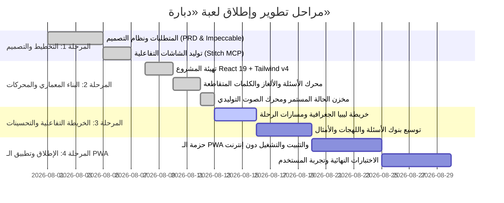

# خارطة طريق مشروع لعبة «دبارة» (Roadmap)

---

## 🎯 حالة المعالم والمراحل (Milestone Progress)

---

### 🟢 المنجز بالكامل (Completed)
- [x] وثيقة متطلبات المنتج [prd.md](file:///c:/Users/masal/Documents/opencode/trivia-game/prd.md).
- [x] نظام التصميم المتكامل (Modern Libyan Neo-Heritage) في [design.md](file:///c:/Users/masal/Documents/opencode/trivia-game/design.md).
- [x] تهيئة بيئة العمل React 19 + TypeScript + Tailwind CSS v4 + Vite 6.
- [x] بناء محرك الأسئلة المتعددة مع بطاقة «معلومة ع الماشي» ووسائل المساعدة 50:50 وكشف الحرف والوقت الإضافي.
- [x] بناء محرك ألغاز ترتيب الحروف (Letter Scramble).
- [x] بناء وتصحيح محرك الكلمات المتقاطعة المصغرة (Mini Crosswords) مع لوحة المفاتيح وتظليل الكلمات المتقاطعة بدون أخطاء.
- [x] بناء وضع سباق الزمن (Speed Blitz) والتحدي اليومي وسلسلة الحضور المتتالية (Daily Streaks).
- [x] بناء مجلس الأوسمة التراثية ومتجر المساعدات بنظام الدنانير الليبية.
- [x] بناء محرك المؤثرات الصوتية الفورية (Web Audio API Synthesizer).
- [x] بناء خريطة ليبيا الجغرافية التفاعلية مع دعم الأقاليم ومسارات الربط المضيئة.

---

### 🟡 قيد التحسين والتطوير (In Progress / Polish)
- [ ] معايرة إحداثيات المدن ونقاط الخريطة على خلفية تضاريس ليبيا الواقعية.
- [ ] إضافة مدن ومناطق جديدة (مصراتة، زوارة، درنة، طبرق، نالوت، جالو).
- [ ] تعزيز بنوك الأسئلة بمعلومات إضافية في التاريخ الحديث والشعر الشعبي والأمثال.

---

### 🔵 المراحل القادمة (Upcoming Milestones)
- [ ] إعداد ملف الـ `manifest.json` وأيقونات التثبيت وتفعيل Service Worker لتطبيق ويب تقدمي (PWA) كامل يعمل 100% Offline.
- [ ] دعم مشاركة نتائج التحدي اليومي كبطاقة إنجاز مصورة على وسائل التواصل الاجتماعي.
- [ ] إضافة وضع التحدي الثنائي المحلي (2-Player Pass & Play).
